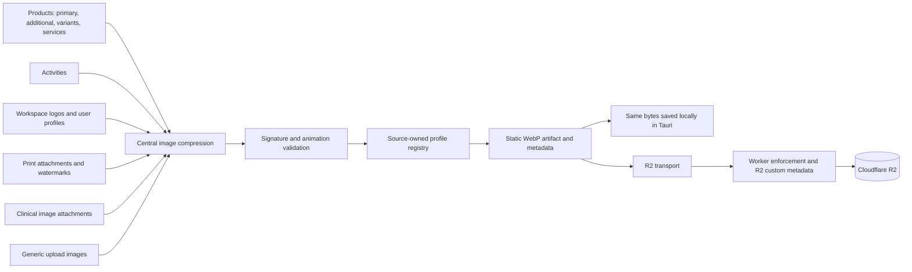

# Centralized image compression

Every new image destined for Cloudflare R2 is validated and compressed to a static WebP before transport. Existing objects are not migrated.

Non-image PDFs, audio, clinical documents, and SQLite backups continue through the generic object transport. That transport rejects image signatures so a new caller cannot accidentally bypass compression.

## Measurement

Run `npm run dev`, open `/image-compression-benchmark.html`, and select **Run benchmark**. The harness generates a deterministic, rights-safe corpus representing product photography, transparent logos, portraits, activities, and high-resolution printed documents. It executes the production browser compressor and reports input/output bytes, reduction, dimensions, encode attempts, elapsed time, and whether each source profile met its soft target. Results are also available at `window.__atlasImageBenchmark` for JSON capture.

The soft target is a quality objective rather than a destructive hard cap. If reducing quality to a profile's floor is insufficient, the compressor proportionally reduces dimensions in bounded passes. It never upscales.

### Baseline measurement

The 2026-09-20 Windows Chromium run met 11/11 soft targets. The noisy product fixture exercised three encode passes and went from 15.82 MiB to 611.6 KiB at 2048×1536 (96.2% smaller). Activity output was 241.1 KiB at 1600×1067; workspace-logo output was 23.5 KiB at 512×256; profile output was 14.8 KiB at 384×512; and print/clinical/generic output was 435.5 KiB at 1920×2560. The complete reproducible result is in `docs/image-compression-benchmark-baseline.json`.

## Rollout

The app accepts only branded compressed artifacts for image PUTs immediately. The Worker logs unmarked legacy image uploads during the compatibility window. Set `R2_REQUIRE_COMPRESSED_IMAGES=true` on the Worker after all deployed clients have updated to reject unmarked image uploads at the edge.
