# Sales Orders hosted Supabase coverage

This document is generated from the executable catalog and choice matrix. Rebuild it with `node scripts/dev-testing/buildSalesOrdersCoverage.mjs` after changing registration.

The generated hosted catalog exposes **30 action groups, 418 scenario families, and 12,159 registered tests**. The suite registry also exposes the standalone `agent-refund-statement` and `agent-account-netting` hosted checks. These are Supabase-only selections. The runner launches live wrappers directly, without first running the isolated Sales Orders suite. The existing isolated selection remains independently available.

The finite Quick Order product is exhaustively enumerated. Continuous amounts, unlimited line counts, arbitrary historical database contents, external services, and unbounded action sequences cannot have a finite exhaustive enumeration. Those use explicit boundary partitions, prepared fixtures, replay/race probes, and seeded sequences. A catalog family describes its coverage objective; a passing representative does not establish every unbounded permutation in that family. Missing prerequisites remain blocked and do not count as passes.

## Run commands

```powershell
# Inspect the exact registered denominator without credentials or database writes.
node scripts/dev-testing/cli.mjs --list-hosted-sales-orders

# All thirty hosted groups. This is a long-running selection.
node scripts/dev-testing/cli.mjs --suite sale-orders --environment hosted-supabase

# One independently selectable group.
node scripts/dev-testing/cli.mjs --suite sale-orders --environment hosted-supabase --groups hosted-financing
node scripts/dev-testing/cli.mjs --suite sale-orders --environment hosted-supabase --groups agent-account-netting

# Stable family IDs select every generated variant within those families.
node scripts/dev-testing/cli.mjs --suite sale-orders --environment hosted-supabase --cases SO-H12-01,SO-H17-01,SO-H20-03 --seed 20260918 --samples 16
```

Use the group IDs in `src/dev/testing/suites.json`; the CLI rejects unknown IDs. `--samples` affects generated model sequences only. It never reduces the finite Quick Order product, currency pairs, or schedule counts. Each test has its full variant in the result title and evidence. A selected family cannot silently reduce to an empty passing group.

The Quick Order group permits a seven-day group timeout; other groups permit one day. Each ordinary test is bounded separately. The 11,187 Quick Order cases alone can require days of hosted requests. Cancel stops the owned hosted child and retains its checkpoint and completed evidence. Do not run the full matrix unintentionally while checking one change.

## Verified target and prerequisites

Credentials are read from the existing gitignored `.env.atlas-live-tests.local`. Use a public Supabase key and ordinary authenticated DEV TEST account. The preflight verifies project origin, exact workspace ID/name, admin identity, accessible workspaces, cloud/hybrid mode, schema, and services capability. It never accepts a service-role key. All HTTP traffic is restricted to that Supabase HTTPS origin; external rate feeds, R2, browser printing, native SQLite, and local sync are outside this hosted selection.

The configured account is the main action actor. An independent Supabase client observes the resulting records with the same verified actor session. Observation is a fresh Data API read; mutation return values and Dexie rows do not supply integrity evidence. The production helpers need IndexedDB for their cache, so the runner provides an in-memory browser cache and hydrates prerequisites from Supabase. Repayment prerequisites use forced hosted hydration so an earlier table freshness window cannot omit a just-created loan. A successful cache write cannot make a failed hosted write pass.

Additional personas, prepared DEV TEST fixtures, and an optional private read-only observer are supplied through gitignored `.atlas-sales-order-hosted.local.json`. The suite does not create or impersonate missing accounts. Example shape, with placeholders only:

```json
{
  "personas": {
    "staff": { "email": "configured staff email", "password": "local secret", "role": "staff", "workspaceId": "DEV TEST workspace UUID", "workspaceName": "DEV TEST Atlas" },
    "viewer": { "email": "configured viewer email", "password": "local secret", "role": "viewer", "workspaceId": "DEV TEST workspace UUID", "workspaceName": "DEV TEST Atlas" },
    "foreign-workspace": { "email": "second test account email", "password": "local secret", "role": "admin", "workspaceId": "second DEV TEST workspace UUID", "workspaceName": "DEV TEST Other" }
  },
  "fixtures": {
    "SO-H05-03": { "customUnitId": "existing unit UUID", "unitName": "test custom unit" },
    "SO-H13-11": { "customUnitId": "existing unit UUID", "unitName": "test custom unit" },
    "SO-H24-01": { "marketplaceOrderId": "prepared pending DEV TEST order UUID" },
    "SO-H29-01": { "orderId": "prepared legacy DEV TEST order UUID" },
    "SO-H30-08": { "orderId": "owned interrupted DEV TEST order UUID", "operationPayload": { "p_order_id": "same order UUID", "p_workspace_id": "same test workspace UUID", "p_operation_id": "original operation UUID", "p_items": [], "p_changes": [] } }
  },
  "observer": { "url": "https://configured-project.supabase.co/functions/v1/read-only-test-observer", "bearer": "local observer token" }
}
```

The example is a shape guide, not executable seed data. Prepared fixtures must have the required existing records and scenario state. Fixture requirements are implemented in `src/dev/testing/hosted/salesOrders/requirements.ts` and validated by their handler. Historical orders and marketplace fixtures must identify themselves as DEV TEST. Persona roles and workspace membership are checked against the server. Special permission persona names are `revoked-member`, `orders-disabled`, `own-only`, `storage-restricted`, `revoked-permission`, `commission-restricted`, and `restricted-staff`.

The optional observer is needed for private operation receipts in SO-H12-12/13. It must be an already configured read-only Edge Function on the same project origin. Its response must declare `readOnly: true`, the correct `workspaceId`, and a `receipts` array with operation ID and payload hash. The suite does not deploy an observer or use elevated database credentials. Its full request/response contract is in `security.ts`.

Fixtures for legacy corruption, changed permissions, disabled entitlements, storefront placement, tracked commissions, automatic settlement, shifts, and invoice versions are explicit prerequisites. The runner reports them as blocked when absent. A blocked test prevents the run from becoming green. It is different from a rejected action that successfully proves a validation rule.

## Choice and action diagrams

```mermaid
flowchart TD
    Suite["Sales Orders · hosted Supabase"]
    D01["01 · Authentication &amp; workspace isolation"]
    Suite --> D01
    D02["02 · Module grants, capabilities &amp; permissions"]
    Suite --> D02
    D03["03 · Customer, partner &amp; sales-account choices"]
    Suite --> D03
    D04["04 · Line composition &amp; catalog snapshots"]
    Suite --> D04
    D05["05 · Units, conversion factors &amp; free bonuses"]
    Suite --> D05
    D06["06 · Prices, price books, costs &amp; floors"]
    Suite --> D06
    D07["07 · Currencies &amp; exchange snapshots"]
    Suite --> D07
    D08["08 · Totals, discounts, taxes &amp; adjustments"]
    Suite --> D08
    D09["09 · Create, edit, retry &amp; numbering"]
    Suite --> D09
    D10["10 · Approval request lifecycle"]
    Suite --> D10
    D11["11 · Reservation &amp; stock availability"]
    Suite --> D11
    D12["12 · Atomic completion &amp; inventory costing"]
    Suite --> D12
    D13["13 · Quick Order method × status matrix"]
    Suite --> D13
    D14["14 · Collections, settlements &amp; reversals"]
    Suite --> D14
    D15["15 · Payment accounts &amp; cashier shifts"]
    Suite --> D15
    D16["16 · Financing activation &amp; initial money"]
    Suite --> D16
    D17["17 · Schedules &amp; linked-loan repayments"]
    Suite --> D17
    D18["18 · Cancellation &amp; financial unwinding"]
    Suite --> D18
    D19["19 · Standard returns &amp; exact refunds"]
    Suite --> D19
    D20["20 · Financed returns &amp; debt reduction"]
    Suite --> D20
    D21["21 · Post-return corrections"]
    Suite --> D21
    D22["22 · Commission sources, plans &amp; snapshots"]
    Suite --> D22
    D23["23 · Commission payout, tracking &amp; recovery"]
    Suite --> D23
    D24["24 · Marketplace state and delivery integration"]
    Suite --> D24
    D25["25 · Locking, deletion, archive &amp; terminal states"]
    Suite --> D25
    D26["26 · Reads, projections &amp; invoice metadata"]
    Suite --> D26
    D27["27 · Remote contracts &amp; direct bypass probes"]
    Suite --> D27
    D28["28 · Concurrency, transport faults &amp; recovery"]
    Suite --> D28
    D29["29 · Historical records &amp; integrity detection"]
    Suite --> D29
    D30["30 · Runner isolation, evidence &amp; final reconciliation"]
    Suite --> D30
```

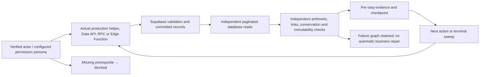

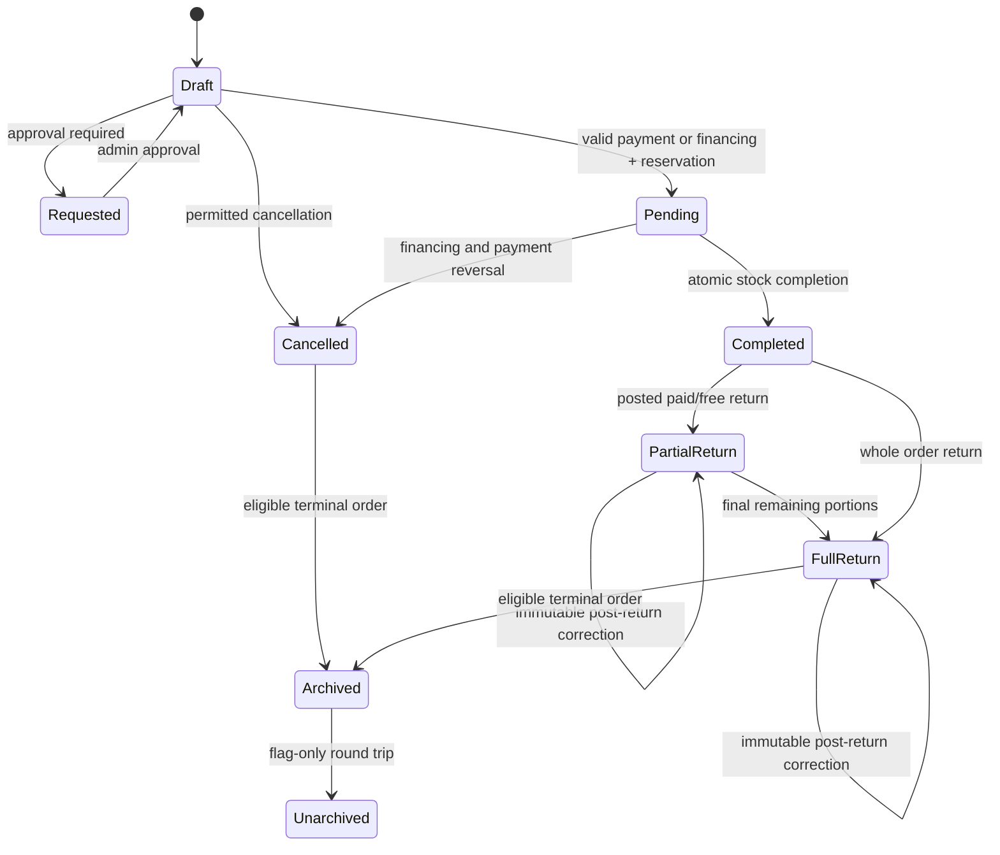

Quick Order family SO-H13-11 enumerates **9,600 tuples**: eight payment methods × three target states × four currencies × paid/unpaid × account/no account × approval/no approval × physical/service/mixed/free lines × applicable base/carton/custom unit × financing initial payment 0/25. Service-only uses its applicable base-unit branch. Financed methods have both initial payment classes. Unsupported tuples are retained as explicit negative probes. SO-H13-01…10 add focused method/state matrices, bringing generated Quick Order tuples to **11,184**, plus three non-tuple contract families.

Other explicit expansions include all 16 ordered currency pairs for create/draft currency edits; 15 rate-source/side provenance branches; every installment count 1…120 across weekly/biweekly/monthly; leap/month/year date partitions; 32 post-return correction currency/sign combinations; 24 standard method/currency account variants; zero/positive fixed commissions and both manual commission types; 45 status/payment/return filter combinations; hosted pagination populations 0/1/199/200/201/501/1001; and 26 request/response interruption boundaries across save, approval, cancellation, settlement, and return chains. Atomic cancellation can be interrupted at its RPC boundary; this suite cannot pause inside a server transaction.

## Independent database oracle

The graph reader paginates every scoped table with stable primary-key ordering, batches large ID sets, discovers tagged orders whose response was lost, and rejects missing results, duplicate/repeated pages, denial, and schema drift. It reads the order, catalog, inventory/batches/history, payment transactions and their counter-entries, loan/schedule/repayments, return headers/items, assignments/commission lanes, payment account balances/movements, invoice metadata, and marketplace origins.

After each action and again at the terminal step, independent calculations check tenant and identity links; selected-to-base paid/free quantities; line and commercial totals; net payment and balance; immutable linked reversals; stock changes explained by movement history; batch bounds; account movement and balance derivation; loan and installment balance; net receipt remaining after partial refunds; original and returned amounts; post-return history; commission attribution; invoice version links; and eligible terminal flags. Scenario-specific assertions verify exact expected values, response-loss replay, rejection atomicity, and permitted race results. Ledger scenarios also read the persisted partner summary and compare currency-specific statements to independently derived obligations.

Money is compared at the application's three-decimal boundary and inventory at six decimals. A partial financed return reduces the current principal by the returned amount; a full financed return preserves the prior current principal as history. An original loan payment remains positive and its refund remains a separate negative linked transaction; the loan receipt stores its remaining net portion. These distinctions are tested rather than treating a historical original amount as the remaining balance.

## Sales-agent account credit netting

The standalone `agent-account-netting` selection creates two DEV TEST sales-account-agent order loans and a persisted partner-account credit. It checks that Payments applies the credit oldest-first, that the remaining obligation equals the partner statement balance, that an overpayment rejected by the hosted loan-payment RPC adds no repayment records, and that Collect records the reduced amount through the existing loan-payment and payment-transaction path. Independent Supabase reads confirm the older loan remains unchanged, the collected loan has the expected remaining gross balance, and the partner has no remaining collectible net balance. The source loans and account-credit transaction stay in Supabase for audit.

## Reports, retention, and review

The main checkpoint/report is `.atlas-test-runs/<run-id>/report.json`; step evidence is under `hosted/<family-id>/<fixture-tag>.json`. It records variant, seed, fixture IDs, action path, request method/path/status, before/after SHA-256 hashes, row counts, named checks, and failed before/after graphs. Credentials, JWTs, and optional persona/observer secrets are redacted from shared runner diagnostics. Checkpoints are serialized and atomically replaced. Denominators are calculated from the executable matrix; a final count mismatch fails the selection.

Passed fixture cleanup retires the main owned product through the supported production action and verifies the persisted deletion flag, zero/deleted inventory positions, stock change explained by archive movements, and unchanged order/payment/return/loan/commission/account history. Cleanup verification failure fails the test. Orders, positive and reversal payments, inventory history, returns, commissions, loans, accounts, and extra catalog fixtures remain for audit. Failed fixtures are retained. There is no recursive table wipe, balance rewrite, or repair during assertions. Long runs consequently grow the DEV TEST database. Retention is not proof that every commercial workflow has been financially unwound.

The runner families SO-H30-01/02 verify registration and hosted evidence structure; the controller's integration tests verify independent group dispatch and exact full-selection counting. They do not recursively launch another 12,000-case run. SO-H30-08 verifies exact replay of a configured original operation payload; it does not automatically infer missing payloads or restart every incomplete historical run.

Database-only checks cannot establish modal behavior, browser printing, actual PDF bytes stored in R2, mobile layout, native SQLite resilience, or external exchange-rate feeds. Invoice-version checks use already prepared hosted metadata; Realtime needs the configured publication. Rate-history checks use actual hosted orders with separately supplied historical snapshots, not a change to an external market-rate service.

## Group totals

| Domain | Hosted group | Families | Tests |
| --- | --- | ---: | ---: |
| 01 | Authentication & workspace isolation | 12 | 12 |
| 02 | Module grants, capabilities & permissions | 12 | 12 |
| 03 | Customer, partner & sales-account choices | 12 | 12 |
| 04 | Line composition & catalog snapshots | 12 | 12 |
| 05 | Units, conversion factors & free bonuses | 14 | 14 |
| 06 | Prices, price books, costs & floors | 14 | 14 |
| 07 | Currencies & exchange snapshots | 12 | 59 |
| 08 | Totals, discounts, taxes & adjustments | 14 | 24 |
| 09 | Create, edit, retry & numbering | 14 | 14 |
| 10 | Approval request lifecycle | 12 | 12 |
| 11 | Reservation & stock availability | 14 | 16 |
| 12 | Atomic completion & inventory costing | 15 | 15 |
| 13 | Quick Order method × status matrix | 14 | 11,187 |
| 14 | Collections, settlements & reversals | 15 | 15 |
| 15 | Payment accounts & cashier shifts | 14 | 37 |
| 16 | Financing activation & initial money | 14 | 17 |
| 17 | Schedules & linked-loan repayments | 14 | 388 |
| 18 | Cancellation & financial unwinding | 15 | 15 |
| 19 | Standard returns & exact refunds | 17 | 17 |
| 20 | Financed returns & debt reduction | 16 | 16 |
| 21 | Post-return corrections | 12 | 43 |
| 22 | Commission sources, plans & snapshots | 15 | 18 |
| 23 | Commission payout, tracking & recovery | 14 | 14 |
| 24 | Marketplace state and delivery integration | 15 | 15 |
| 25 | Locking, deletion, archive & terminal states | 15 | 15 |
| 26 | Reads, projections & invoice metadata | 15 | 65 |
| 27 | Remote contracts & direct bypass probes | 14 | 14 |
| 28 | Concurrency, transport faults & recovery | 18 | 43 |
| 29 | Historical records & integrity detection | 12 | 12 |
| 30 | Runner isolation, evidence & final reconciliation | 12 | 12 |
| Total | | 418 | 12,159 |

The following pages preserve every catalog family, its action path, integrity witness, and generated denominator. Review execution results alongside the catalog: registration is not a claim that every test has run or passed.

## 01 · Authentication & workspace isolation

Hosted action surface: Supabase Auth → authenticated Data API / RPC.

Database graph: profiles · workspaces · every order-linked table.

Cross checks: persona × workspace membership × active context × token state.

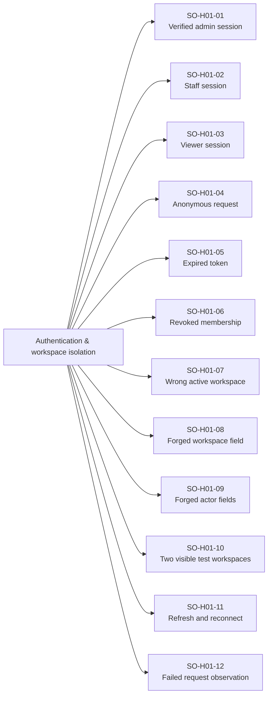

| Family | Scenario | Action path | Independent integrity witness | Registered tests |
| --- | --- | --- | --- | ---: |
| SO-H01-01 | Verified admin session | Sign in → create → new reader | Order belongs to approved test workspace and actor | 1 |
| SO-H01-02 | Staff session | Sign in as staff → allowed mutation | Permission-scoped records and actor stamps | 1 |
| SO-H01-03 | Viewer session | Viewer → every write surface | Denied write; full graph unchanged | 1 |
| SO-H01-04 | Anonymous request | No JWT → read / CRUD / RPC | No protected rows exposed or changed | 1 |
| SO-H01-05 | Expired token | Expire session → repeat action | Authentication failure; no partial mutation | 1 |
| SO-H01-06 | Revoked membership | Membership removal → stale session action | Server denies according to current membership | 1 |
| SO-H01-07 | Wrong active workspace | Valid JWT in workspace A → order in B | No cross-workspace read or write | 1 |
| SO-H01-08 | Forged workspace field | A session → payload workspace B | Every linked row stays tenant-scoped | 1 |
| SO-H01-09 | Forged actor fields | User A → created/reviewed/returned actor B | Authoritative audit stamp or rejection | 1 |
| SO-H01-10 | Two visible test workspaces | A / B memberships → switch context | Only intended context mutated | 1 |
| SO-H01-11 | Refresh and reconnect | Token refresh → rerun with same IDs | No duplicate order or money | 1 |
| SO-H01-12 | Failed request observation | Denied client → privileged read-only witness | Zero unauthorized database delta | 1 |

## 02 · Module grants, capabilities & permissions

Hosted action surface: Hosted entitlement / role checks on each write and RPC.

Database graph: workspace configuration · role grants · storages · sales_orders.

Cross checks: plan × explicit grant × role × own-only × storage scope × feature switches.

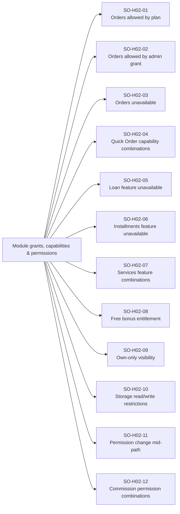

| Family | Scenario | Action path | Independent integrity witness | Registered tests |
| --- | --- | --- | --- | ---: |
| SO-H02-01 | Orders allowed by plan | Plan entitlement → regular order | Expected hosted action permitted | 1 |
| SO-H02-02 | Orders allowed by admin grant | Grant → same complete path | Identical integrity effects | 1 |
| SO-H02-03 | Orders unavailable | No entitlement → all order endpoints | Denied; zero effects | 1 |
| SO-H02-04 | Quick Order capability combinations | POS / orders / quickOrder on and off | Every capability gate enforced | 1 |
| SO-H02-05 | Loan feature unavailable | Loan payload → activation endpoint | No unauthorized linked loan | 1 |
| SO-H02-06 | Installments feature unavailable | Installment payload → activation | No unauthorized schedule | 1 |
| SO-H02-07 | Services feature combinations | Service / mixed orders under grants | Correct entitlement and zero service stock | 1 |
| SO-H02-08 | Free bonus entitlement | Paid/free quantities with capability off/on | Bonus choice enforced without extra price | 1 |
| SO-H02-09 | Own-only visibility | Own order / another creator order | Read, return and write scope checked | 1 |
| SO-H02-10 | Storage read/write restrictions | Allowed / read-only / denied positions | No hidden line mutated | 1 |
| SO-H02-11 | Permission change mid-path | Revoke between save and complete | Server gates next action; prior graph valid | 1 |
| SO-H02-12 | Commission permission combinations | Assign / view-own / view-all / pay rights | Each commission surface independently scoped | 1 |

## 03 · Customer, partner & sales-account choices

Hosted action surface: crm scoped partner RPCs → order remote writes.

Database graph: crm.business_partners · crm.customers · crm.agents · sales_orders.

Cross checks: counterparty kind × facet state × currency × price book × sales account.

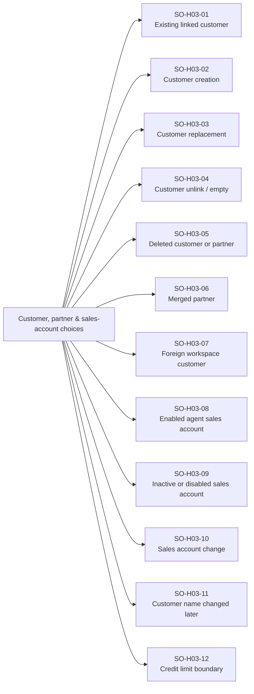

| Family | Scenario | Action path | Independent integrity witness | Registered tests |
| --- | --- | --- | --- | ---: |
| SO-H03-01 | Existing linked customer | Select partner/customer facet → save | Consistent customer_id + business_partner_id | 1 |
| SO-H03-02 | Customer creation | Create via hosted partner API → order | Customer facet and partner link persisted | 1 |
| SO-H03-03 | Customer replacement | Draft A → partner B → save | New references; no stale obligation attribution | 1 |
| SO-H03-04 | Customer unlink / empty | Missing linked customer → remote probe | No orphan order or wrong party payment | 1 |
| SO-H03-05 | Deleted customer or partner | Delete/retire fixture → stale selection | Rejected or supported normalization; no wrong link | 1 |
| SO-H03-06 | Merged partner | Merged source → order save | Canonical partner selected by contract | 1 |
| SO-H03-07 | Foreign workspace customer | A order → B customer ID | Rejected; sentinel B unchanged | 1 |
| SO-H03-08 | Enabled agent sales account | Select agent financial counterparty | Partner/customer and agent links consistent | 1 |
| SO-H03-09 | Inactive or disabled sales account | Stale agent account → create | No unauthorized financial counterparty | 1 |
| SO-H03-10 | Sales account change | Draft account A → B / ordinary customer | Beneficiary and summary attribution updated | 1 |
| SO-H03-11 | Customer name changed later | Save → rename partner → reread | Historical name snapshot policy preserved | 1 |
| SO-H03-12 | Credit limit boundary | Obligation below / at / above configured limit | Expected rule enforced; no phantom balance | 1 |

## 04 · Line composition & catalog snapshots

Hosted action surface: crm.sales_orders JSONB items + product/storage contracts.

Database graph: products · storages · sales_orders.items.

Cross checks: physical/service mix × line count × duplicate positions × metadata.

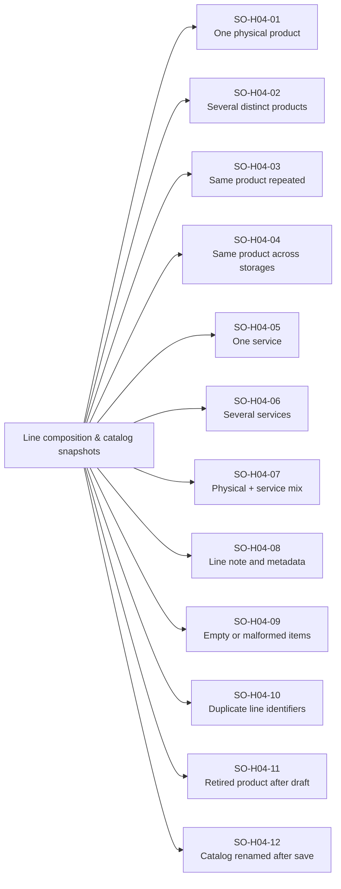

| Family | Scenario | Action path | Independent integrity witness | Registered tests |
| --- | --- | --- | --- | ---: |
| SO-H04-01 | One physical product | Create → reserve → complete | One physical demand and fulfillment | 1 |
| SO-H04-02 | Several distinct products | All line permutations → complete | Exact per-product effects | 1 |
| SO-H04-03 | Same product repeated | Two prices/notes for one product position | Distinct lines; aggregated stock movement | 1 |
| SO-H04-04 | Same product across storages | Split lines A/B → complete | Separate inventory position deltas | 1 |
| SO-H04-05 | One service | Service-only → complete | No inventory/batch mutation | 1 |
| SO-H04-06 | Several services | Fractional service quantities → complete | Service fulfillment and money snapshots | 1 |
| SO-H04-07 | Physical + service mix | Mixed permutations → complete | Atomic physical effects; no service stock | 1 |
| SO-H04-08 | Line note and metadata | Add/edit/clear line notes → save | Unicode text and service snapshots round-trip | 1 |
| SO-H04-09 | Empty or malformed items | Empty / object / null / non-object element | Rejected; no partial records | 1 |
| SO-H04-10 | Duplicate line identifiers | Repeated item ID → save/complete | No ambiguous return references | 1 |
| SO-H04-11 | Retired product after draft | Retire before reserve/complete | Correct failure and historical read | 1 |
| SO-H04-12 | Catalog renamed after save | Change SKU/name/service label → reread | Immutable order-line snapshots retained | 1 |

## 05 · Units, conversion factors & free bonuses

Hosted action surface: Product UoM contracts → order/completion/return APIs.

Database graph: product UoMs · items JSONB · inventory · order_return_items.

Cross checks: base/non-base/custom/dynamic unit × paid/free split × factor × quantity partition.

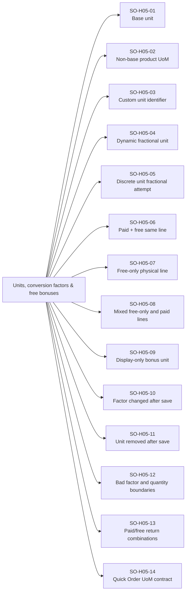

| Family | Scenario | Action path | Independent integrity witness | Registered tests |
| --- | --- | --- | --- | ---: |
| SO-H05-01 | Base unit | Factor 1 → fulfill → return | Selected and inventory quantities agree | 1 |
| SO-H05-02 | Non-base product UoM | Cartons/packs → base-unit deduction | Saved coefficient applied once | 1 |
| SO-H05-03 | Custom unit identifier | Custom unit → rename → return | Stable refs and historical labels | 1 |
| SO-H05-04 | Dynamic fractional unit | Fractional measure → completion | 6-decimal quantity contract | 1 |
| SO-H05-05 | Discrete unit fractional attempt | Fractional piece/carton payload | Reject invalid commercial quantity | 1 |
| SO-H05-06 | Paid + free same line | Sold quantity + bonus → fulfill | Money on paid quantity; stock on both | 1 |
| SO-H05-07 | Free-only physical line | Paid zero + free positive → complete | Stock deducted; no zero-value payment | 1 |
| SO-H05-08 | Mixed free-only and paid lines | All line permutations → return | Money and bonus attribution separated | 1 |
| SO-H05-09 | Display-only bonus unit | Alternate bonus label → complete | Label does not change stock factor | 1 |
| SO-H05-10 | Factor changed after save | Save → edit current UoM factor → return | Historical saved factor wins | 1 |
| SO-H05-11 | Unit removed after save | Retire UoM → read / allowed lifecycle | Historical integrity or explicit stale-config failure | 1 |
| SO-H05-12 | Bad factor and quantity boundaries | Zero/negative/nonfinite factor; epsilon boundaries | No invalid demand or return parts | 1 |
| SO-H05-13 | Paid/free return combinations | Paid-only / free-only / both / all | Correct selected/base parts and zero bonus refund | 1 |
| SO-H05-14 | Quick Order UoM contract | Same unit choices through atomic checkout | Deployed unit support + exact demand; drift reported | 1 |

## 06 · Prices, price books, costs & floors

Hosted action surface: validate_staff_minimum_selling_prices + save/completion validation.

Database graph: products · price books/items/UoM prices · immutable order cost and price snapshots.

Cross checks: price origin × unit × actor × source currency × cost/floor boundary.

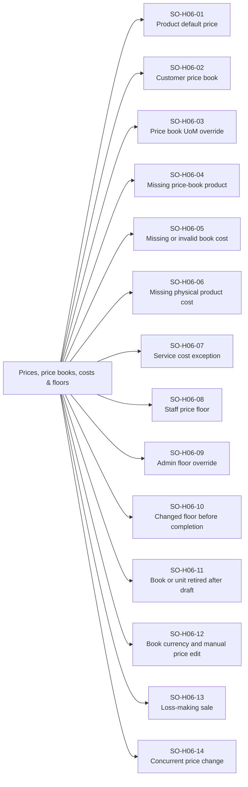

| Family | Scenario | Action path | Independent integrity witness | Registered tests |
| --- | --- | --- | --- | ---: |
| SO-H06-01 | Product default price | Default catalog price → order | Source/converted price snapshots | 1 |
| SO-H06-02 | Customer price book | Partner price book → selected product/unit | Book IDs + item IDs + price provenance | 1 |
| SO-H06-03 | Price book UoM override | Non-base unit price/cost override | Selected-unit price and cost independent of coefficient | 1 |
| SO-H06-04 | Missing price-book product | No matching row → save | Supported fallback without false provenance | 1 |
| SO-H06-05 | Missing or invalid book cost | Matching book price without valid cost | Rejected before sales effects | 1 |
| SO-H06-06 | Missing physical product cost | Null/zero/negative cost → create/advance | Hosted required-cost rule tested | 1 |
| SO-H06-07 | Service cost exception | Service with optional cost → complete | No physical cost/storage rule leakage | 1 |
| SO-H06-08 | Staff price floor | Below / exact / above unit minimum | Correct remote validation per line | 1 |
| SO-H06-09 | Admin floor override | Admin at same price boundaries | Documented privileged outcome; valid money | 1 |
| SO-H06-10 | Changed floor before completion | Save → increase current minimum → complete | No stale staff-floor bypass | 1 |
| SO-H06-11 | Book or unit retired after draft | Retire source → edit / complete | Explicit stale source policy; prior snapshot retained | 1 |
| SO-H06-12 | Book currency and manual price edit | Convert → override → save | Provenance and original prices match chosen contract | 1 |
| SO-H06-13 | Loss-making sale | Below cost with allowed role/choice → save | Exact negative profit; no hidden recalculation | 1 |
| SO-H06-14 | Concurrent price change | Two readers → catalog update → save | Conflict/revalidation and immutable historical snapshot | 1 |

## 07 · Currencies & exchange snapshots

Hosted action surface: Hosted currency fields + persisted exchange snapshots.

Database graph: sales_orders.exchange_rates · line original/settlement currencies · payment/loan currencies.

Cross checks: USD/EUR/IQD/TRY × all source→settlement pairs × snapshot validity.

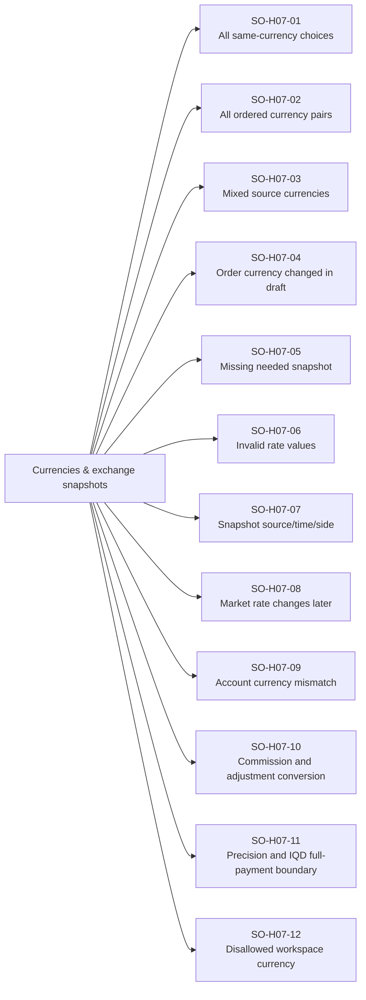

| Family | Scenario | Action path | Independent integrity witness | Registered tests |
| --- | --- | --- | --- | ---: |
| SO-H07-01 | All same-currency choices | Each of four currencies → full path | No unnecessary conversion; correct stored currency | 4 |
| SO-H07-02 | All ordered currency pairs | 4 source × 4 settlement choices | 16 distinct source/settlement contracts | 16 |
| SO-H07-03 | Mixed source currencies | Several products in different currencies | Per-line conversion + order snapshots | 1 |
| SO-H07-04 | Order currency changed in draft | Each supported A→B change | Prices, adjustments and totals reproject consistently | 16 |
| SO-H07-05 | Missing needed snapshot | Cross-currency data without rate | Clear contract failure; no unpriced money | 1 |
| SO-H07-06 | Invalid rate values | Zero/negative/nonfinite rate → remote probe | Invalid financial snapshots rejected | 1 |
| SO-H07-07 | Snapshot source/time/side | buy/sell/mid and provenance fields | Complete historical conversion evidence | 15 |
| SO-H07-08 | Market rate changes later | Save → hosted rate update → return | Historical paid/refund values remain stable | 1 |
| SO-H07-09 | Account currency mismatch | Order USD → incompatible account | No cross-currency account movement | 1 |
| SO-H07-10 | Commission and adjustment conversion | Different source currencies simultaneously | Independent snapshot conversions | 1 |
| SO-H07-11 | Precision and IQD full-payment boundary | 3 decimals + supported IQD rounding branches | Exact accepted/denied values; no balance drift | 1 |
| SO-H07-12 | Disallowed workspace currency | Currency disabled → action payload | Entitlement/current currency contract verified | 1 |

## 08 · Totals, discounts, taxes & adjustments

Hosted action surface: Persisted order totals and adjustment JSONB.

Database graph: sales_orders amounts · order_adjustments · payments · financing basis.

Cross checks: discount/tax classes × addition/deduction × currencies × line/rounding partitions.

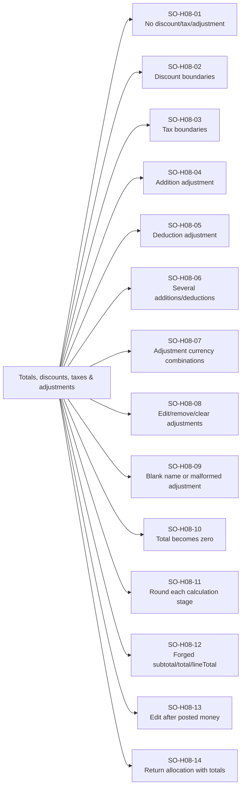

| Family | Scenario | Action path | Independent integrity witness | Registered tests |
| --- | --- | --- | --- | ---: |
| SO-H08-01 | No discount/tax/adjustment | Line sum → save → complete | Independent subtotal and total | 1 |
| SO-H08-02 | Discount boundaries | Zero / partial / exact subtotal / excessive | No invalid negative obligation | 6 |
| SO-H08-03 | Tax boundaries | Zero / fractional / positive / invalid | Stored tax and total contract | 6 |
| SO-H08-04 | Addition adjustment | Named positive addition → save | Positive converted amount and final total | 1 |
| SO-H08-05 | Deduction adjustment | Named positive deduction → save | Negative net effect with valid total | 1 |
| SO-H08-06 | Several additions/deductions | Every sign/order combination | Order-independent allowed total effect | 1 |
| SO-H08-07 | Adjustment currency combinations | Each source/order currency pair | Correct original and converted amounts | 1 |
| SO-H08-08 | Edit/remove/clear adjustments | Draft list replacements → save | JSONB clears remotely; no stale additions | 1 |
| SO-H08-09 | Blank name or malformed adjustment | Missing type/name/currency/amount | Hosted contract rejection or reported server gap | 1 |
| SO-H08-10 | Total becomes zero | Discount/free-only boundary → fulfill | No zero-value real payment | 1 |
| SO-H08-11 | Round each calculation stage | Fractional price × quantity + adjustments | 3-decimal checkpoint oracle | 1 |
| SO-H08-12 | Forged subtotal/total/lineTotal | Valid lines + tampered summary fields | No inconsistent obligation accepted silently | 1 |
| SO-H08-13 | Edit after posted money | Change total below/equal/above collected | Exact reconciliation or meaningful rejection | 1 |
| SO-H08-14 | Return allocation with totals | Discount + tax + mixed adjustments → partial/full return | Cumulative refund matches original value | 1 |

## 09 · Create, edit, retry & numbering

Hosted action surface: Production authenticated save sequence → crm.sales_orders upsert.

Database graph: sales_orders · payment_transactions · order number trigger · partner projections.

Cross checks: new/edit/retry × paid/financed/request × metadata × version.

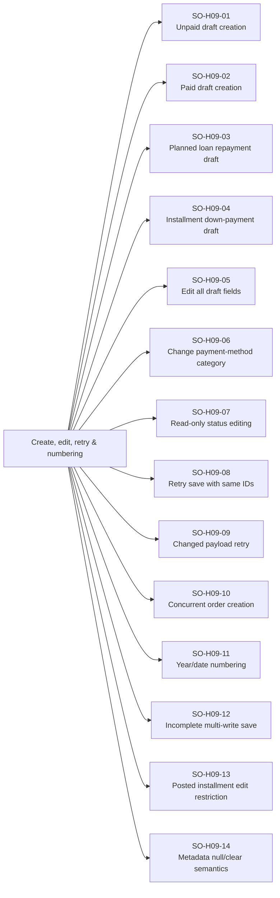

| Family | Scenario | Action path | Independent integrity witness | Registered tests |
| --- | --- | --- | --- | ---: |
| SO-H09-01 | Unpaid draft creation | Create → independent reread | Order saved; no stock or money movement | 1 |
| SO-H09-02 | Paid draft creation | Initial payment → save → confirm | Exactly one payment linked to order | 1 |
| SO-H09-03 | Planned loan repayment draft | Save simple loan + planned repayment | No repayment posted before activation | 1 |
| SO-H09-04 | Installment down-payment draft | Save with down payment | Payment contract differs from simple loan | 1 |
| SO-H09-05 | Edit all draft fields | Customer/lines/notes/address/dates → save | Every supported field persisted accurately | 1 |
| SO-H09-06 | Change payment-method category | Standard ↔ loan ↔ installments in draft | Correct clearing/link rules; no duplicate money | 1 |
| SO-H09-07 | Read-only status editing | Pending/completed/cancelled/legacy returned → edit probe | Immutable-state contract tested | 1 |
| SO-H09-08 | Retry save with same IDs | Response loss → retry order/payment IDs | Exactly one order number and initial payment | 1 |
| SO-H09-09 | Changed payload retry | Same identity + changed values | Version conflict or documented edit; no silent duplicate | 1 |
| SO-H09-10 | Concurrent order creation | Many independent creates | Unique atomic order numbers | 1 |
| SO-H09-11 | Year/date numbering | Backdated/current/year boundary create | Server numbering policy preserved on upsert | 1 |
| SO-H09-12 | Incomplete multi-write save | Interrupt after payment/order boundary | Recorded durable prefix; recovery evidence required | 1 |
| SO-H09-13 | Posted installment edit restriction | Post repayment → draft edit attempt | No rewriting posted schedule or payment history | 1 |
| SO-H09-14 | Metadata null/clear semantics | Clear delivery/shipping/note/rate fields | Null vs omitted request contracts verified | 1 |

## 10 · Approval request lifecycle

Hosted action surface: Requested draft → approval remote writes + notification queue triggers.

Database graph: sales_orders approval fields · payment transactions · notification queue.

Cross checks: request-only permission × actor × method × planned payment × draft changes.

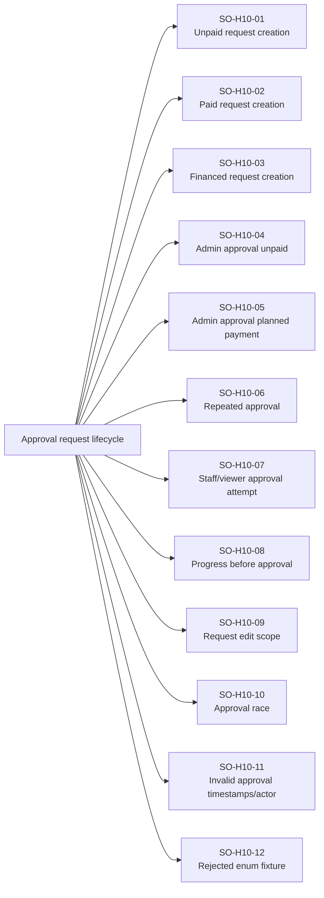

| Family | Scenario | Action path | Independent integrity witness | Registered tests |
| --- | --- | --- | --- | ---: |
| SO-H10-01 | Unpaid request creation | Request-only actor → draft | Requested fields persisted; no stock movement | 1 |
| SO-H10-02 | Paid request creation | Planned paid request → save | No real initial payment before approval | 1 |
| SO-H10-03 | Financed request creation | Loan/installments request → save | Financing activation remains deferred | 1 |
| SO-H10-04 | Admin approval unpaid | Admin approves → reread | Reviewer stamp; draft lifecycle retained | 1 |
| SO-H10-05 | Admin approval planned payment | Approve paid request | One linked payment; exact account effect | 1 |
| SO-H10-06 | Repeated approval | Approve twice / lost response retry | No duplicate money or approval notification | 1 |
| SO-H10-07 | Staff/viewer approval attempt | Unauthorized persona → approval write | No privileged reviewer action | 1 |
| SO-H10-08 | Progress before approval | Requested order → reserve/complete/pay/return | No premature effects | 1 |
| SO-H10-09 | Request edit scope | Requester vs admin → edit request | Correct ownership/permission contract | 1 |
| SO-H10-10 | Approval race | Two admins / edit vs approve | One valid reviewed snapshot | 1 |
| SO-H10-11 | Invalid approval timestamps/actor | Forged requested/reviewed metadata | Server request policy checked | 1 |
| SO-H10-12 | Rejected enum fixture | Stored rejected state → action probes | Supported enum assessed; no invented reject workflow | 1 |

## 11 · Reservation & stock availability

Hosted action surface: Production reserve write / activate_financed_order + stock reads.

Database graph: sales_orders pending/reserved fields · inventory availability · financing records.

Cross checks: order mode × stock/batch choice × reservations × line aggregation × service mix.

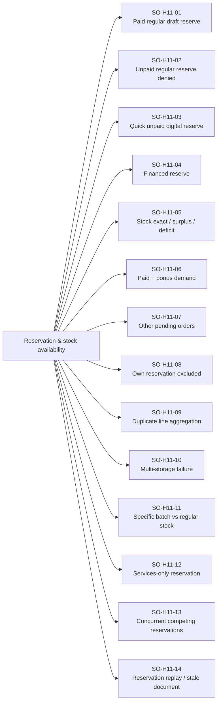

| Family | Scenario | Action path | Independent integrity witness | Registered tests |
| --- | --- | --- | --- | ---: |
| SO-H11-01 | Paid regular draft reserve | Draft paid → pending | Reservation fields set; no physical deduction | 1 |
| SO-H11-02 | Unpaid regular reserve denied | Unpaid/partial standard draft → reserve | No reservation or financial activation | 1 |
| SO-H11-03 | Quick unpaid digital reserve | Quick draft digital unpaid → pending | Allowed quick-path reservation; no fake payment | 1 |
| SO-H11-04 | Financed reserve | Valid draft → pending activation | Loan and reservation share expected state | 1 |
| SO-H11-05 | Stock exact / surplus / deficit | Demand below/at/above availability | Correct boundary, zero deficit | 3 |
| SO-H11-06 | Paid + bonus demand | Reserve both quantity portions | Bonus stock included | 1 |
| SO-H11-07 | Other pending orders | Reserve against same inventory position | Availability excludes committed reservations | 1 |
| SO-H11-08 | Own reservation excluded | Reserve/complete same order | No double-counted own demand | 1 |
| SO-H11-09 | Duplicate line aggregation | Repeated position demands → reserve | Summed demand vs availability | 1 |
| SO-H11-10 | Multi-storage failure | One valid position + one shortage | No invalid partial reservation accepted | 1 |
| SO-H11-11 | Specific batch vs regular stock | Explicit batch / regular unbatched demand | Matching available source choice | 1 |
| SO-H11-12 | Services-only reservation | Services → pending | No physical source or stock required | 1 |
| SO-H11-13 | Concurrent competing reservations | Two orders consume last available stock | Only permitted combined reservation survives | 1 |
| SO-H11-14 | Reservation replay / stale document | Repeat / wrong state / changed lines | Idempotency or explicit conflict; no phantom availability | 1 |

## 12 · Atomic completion & inventory costing

Hosted action surface: complete_sales_order_with_inventory.

Database graph: sales_orders · inventory · stock_batches · inventory_transactions · private receipts.

Cross checks: physical/service/mixed × positions × batches × cost/currency × expected versions.

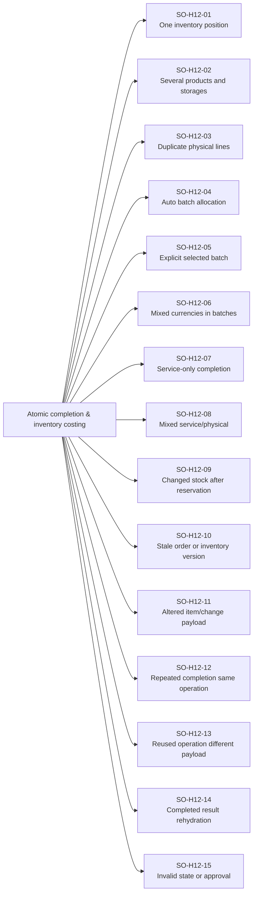

| Family | Scenario | Action path | Independent integrity witness | Registered tests |
| --- | --- | --- | --- | ---: |
| SO-H12-01 | One inventory position | Pending → atomic complete | One exact deduction + fulfilled quantities | 1 |
| SO-H12-02 | Several products and storages | Complete aggregated demand | Each position moves once; complete graph atomic | 1 |
| SO-H12-03 | Duplicate physical lines | Same position with different price/unit | Aggregate inventory; retain commercial line identities | 1 |
| SO-H12-04 | Auto batch allocation | Multiple expiry dates + regular stock | Expected deterministic allocation and costs | 1 |
| SO-H12-05 | Explicit selected batch | Saved allocation → complete | Only specified valid batch quantities deducted | 1 |
| SO-H12-06 | Mixed currencies in batches | Batch source currency → order settlement | Original/converted costs preserved | 1 |
| SO-H12-07 | Service-only completion | Empty physical changes → complete | Completion receipt; no inventory movements | 1 |
| SO-H12-08 | Mixed service/physical | Several lines → complete | All fulfill; only physical positions move | 1 |
| SO-H12-09 | Changed stock after reservation | Reservation → external stock change → complete | Deficit rejects entire completion | 1 |
| SO-H12-10 | Stale order or inventory version | Wrong expected version → RPC | Conflict envelope; unchanged persisted graph | 1 |
| SO-H12-11 | Altered item/change payload | Omitted/extra position or wrong delta | No mismatched stock movement | 1 |
| SO-H12-12 | Repeated completion same operation | Same payload / response loss / parallel replay | One receipt + one sale movement per position | 1 |
| SO-H12-13 | Reused operation different payload | Same operation ID + changed items/quantity | Replay conflict; no altered fulfillment | 1 |
| SO-H12-14 | Completed result rehydration | Discard response → fresh read | Authoritative delivered time/cost/items match database | 1 |
| SO-H12-15 | Invalid state or approval | Draft/cancelled/requested order → complete RPC | No bypass of lifecycle and approval | 1 |

## 13 · Quick Order method × status matrix

Hosted action surface: complete_quick_sales_order or regular draft/reserve/complete request chain.

Database graph: sales_orders · payments · inventory/batches/movements · loans.

Cross checks: 3 target statuses × 8 methods × payment choices × 4 currencies × units × accounts.

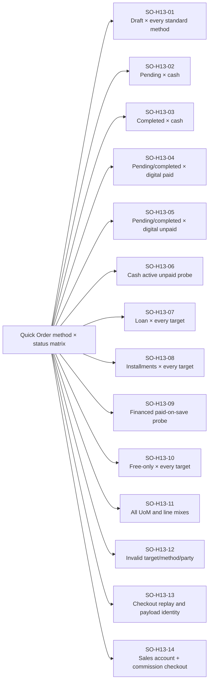

| Family | Scenario | Action path | Independent integrity witness | Registered tests |
| --- | --- | --- | --- | ---: |
| SO-H13-01 | Draft × every standard method | Cash/FIB/QiCard/ZainCash/FastPay/bank transfer → draft | Paid/unpaid choice effects persisted | 192 |
| SO-H13-02 | Pending × cash | Cash paid → draft/reserve | Full payment; pending stock remains undeducted | 32 |
| SO-H13-03 | Completed × cash | Cash paid → atomic checkout | Order, payment, stock effects together | 32 |
| SO-H13-04 | Pending/completed × digital paid | Each digital/bank method × target | Correct selected remote route and effects | 160 |
| SO-H13-05 | Pending/completed × digital unpaid | Each digital/bank method unpaid | Receivable obligation + no invented collection | 160 |
| SO-H13-06 | Cash active unpaid probe | Cash pending/completed unpaid payload | Choice gate tested; server gap retained if bypassed | 48 |
| SO-H13-07 | Loan × every target | No initial or partial initial repayment | Activation timing follows selected status | 96 |
| SO-H13-08 | Installments × every target | Down-payment classes + all schedule choices | Standard financing route; no atomic paid shortcut | 96 |
| SO-H13-09 | Financed paid-on-save probe | Loan/installments paid payload | Rejected without zero/invalid loan | 192 |
| SO-H13-10 | Free-only × every target | Zero monetary value with free stock | No zero-value payment request | 576 |
| SO-H13-11 | All UoM and line mixes | Base/non-base/dynamic + service/physical | Hosted unit handling and inventory conversion | 9,600 |
| SO-H13-12 | Invalid target/method/party | Malformed quick payloads | Atomic no-effect rejection | 1 |
| SO-H13-13 | Checkout replay and payload identity | Same order ID identical/altered request | One checkout; mismatches surfaced | 1 |
| SO-H13-14 | Sales account + commission checkout | Each attribution choice → quick complete | Correct counterparty, creator and commission basis | 1 |

## 14 · Collections, settlements & reversals

Hosted action surface: Production payment_transactions writes + order rebuild / settlement operation.

Database graph: payment_transactions · sales_orders · order_installments · partner settlement operations.

Cross checks: all standard methods × amounts × order states × account choices × reversal order.

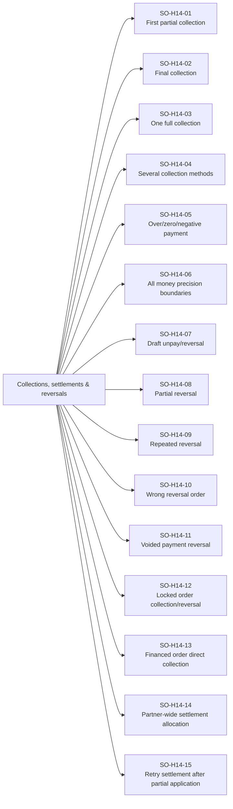

| Family | Scenario | Action path | Independent integrity witness | Registered tests |
| --- | --- | --- | --- | ---: |
| SO-H14-01 | First partial collection | Unpaid → collect partial | One incoming payment; exact remaining balance | 1 |
| SO-H14-02 | Final collection | Partial → remaining balance payment | Paid state + zero balance | 1 |
| SO-H14-03 | One full collection | Unpaid → full amount | One receipt; exact paid fields | 1 |
| SO-H14-04 | Several collection methods | Split receipts across every method pair | Exact per-method records; total net correct | 1 |
| SO-H14-05 | Over/zero/negative payment | Boundary-invalid collection amounts | No invalid transaction or balance | 1 |
| SO-H14-06 | All money precision boundaries | 0.001 steps and epsilon thresholds | Independent decimal expected values | 1 |
| SO-H14-07 | Draft unpay/reversal | Paid draft → reverse allowed receipts | Separate linked counter-entry; unpaid balance | 1 |
| SO-H14-08 | Partial reversal | Reverse part of standard payment | Original immutable; remaining receipt matches delta | 1 |
| SO-H14-09 | Repeated reversal | Several portions → full reversal | Total reversed never exceeds original | 1 |
| SO-H14-10 | Wrong reversal order | Nonlatest receipt / reversal-of-reversal | Expected ordering restrictions; no new counter-entry | 1 |
| SO-H14-11 | Voided payment reversal | Voided source → reversal attempt | Denied; historical void evidence retained | 1 |
| SO-H14-12 | Locked order collection/reversal | Money action after payment lock | Lock rule enforced across surfaces | 1 |
| SO-H14-13 | Financed order direct collection | Order settlement while linked loan exists | No double collection outside loan contract | 1 |
| SO-H14-14 | Partner-wide settlement allocation | Order among several obligations → partial batch settlement | Order portion and settlementOperationId exact | 1 |
| SO-H14-15 | Retry settlement after partial application | Interrupted multi-obligation operation → resume | No repeated already-recorded order payment | 1 |

## 15 · Payment accounts & cashier shifts

Hosted action surface: Payment transaction account triggers + account restrictions.

Database graph: payment_accounts.accounts/account_movements/account_balances · cashier shifts.

Cross checks: account omitted/valid/type/currency/access/state × incoming/outgoing × shift state.

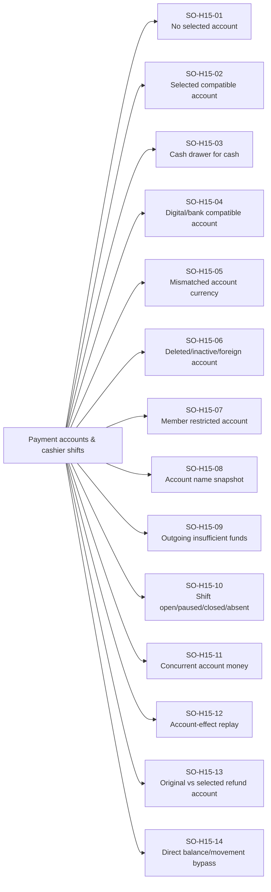

| Family | Scenario | Action path | Independent integrity witness | Registered tests |
| --- | --- | --- | --- | ---: |
| SO-H15-01 | No selected account | Collection/down payment/refund without account | Payment recorded; no account movement | 1 |
| SO-H15-02 | Selected compatible account | Money action with account ID + name | One linked account movement; correct signed delta | 1 |
| SO-H15-03 | Cash drawer for cash | Cash method + permitted cash drawer | Correct drawer/shift link | 1 |
| SO-H15-04 | Digital/bank compatible account | Each standard method × supported account type | Contract-specific account eligibility | 24 |
| SO-H15-05 | Mismatched account currency | Money currency A / account currency B | No incompatible movement | 1 |
| SO-H15-06 | Deleted/inactive/foreign account | Stale or cross-workspace account IDs | Atomic payment denial; graph unchanged | 1 |
| SO-H15-07 | Member restricted account | Allowed and denied personas → same account | Server membership restrictions enforced | 1 |
| SO-H15-08 | Account name snapshot | Record → rename account → reverse | Historical name and selected refund-account policy | 1 |
| SO-H15-09 | Outgoing insufficient funds | Refund / commission with low account funds | No negative balance where prohibited | 1 |
| SO-H15-10 | Shift open/paused/closed/absent | Cash actions through each shift class | Correct assignment or denial | 1 |
| SO-H15-11 | Concurrent account money | Two incoming/outgoing actions on shared account | No lost update; exact balance from movements | 1 |
| SO-H15-12 | Account-effect replay | Repeat transaction ID → account trigger | One movement per source; no doubled balance | 1 |
| SO-H15-13 | Original vs selected refund account | No override / same / different compatible refund account | Movement origin follows actual refund contract | 1 |
| SO-H15-14 | Direct balance/movement bypass | Forged movement/balance update request | No unauthorized balance alteration | 1 |

## 16 · Financing activation & initial money

Hosted action surface: activate_financed_order · create_order_financing_loan.

Database graph: sales_orders.linked_loan_id · loans · loan_installments · loan_payments · payment_transactions.

Cross checks: simple/standard loan × initial amount × due terms × currency × account × approval.

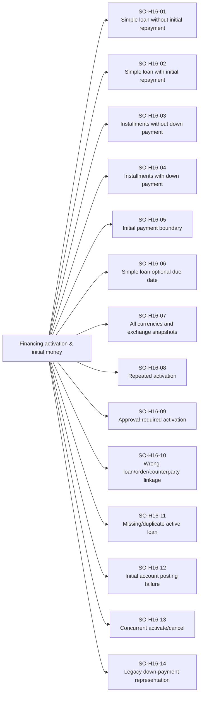

| Family | Scenario | Action path | Independent integrity witness | Registered tests |
| --- | --- | --- | --- | ---: |
| SO-H16-01 | Simple loan without initial repayment | Draft → activate → pending | Principal=order basis; unpaid linked loan | 1 |
| SO-H16-02 | Simple loan with initial repayment | Planned draft repayment → activation | One loan repayment and matching transaction | 1 |
| SO-H16-03 | Installments without down payment | Draft → activation | Full financed principal and complete schedule | 1 |
| SO-H16-04 | Installments with down payment | Draft payment + activation | Principal and remaining basis exclude down payment once | 1 |
| SO-H16-05 | Initial payment boundary | Zero / partial / exact total / excessive | Positive financed remainder required | 1 |
| SO-H16-06 | Simple loan optional due date | No due date vs specified due date | Correct schedule/next-due behavior | 1 |
| SO-H16-07 | All currencies and exchange snapshots | Activate each supported monetary choice | Loan/order/partner currency mapping | 4 |
| SO-H16-08 | Repeated activation | Same order already linked → activate again | Exactly one active loan and initial repayment | 1 |
| SO-H16-09 | Approval-required activation | Requested draft → RPC attempt | No unauthorized financed obligation | 1 |
| SO-H16-10 | Wrong loan/order/counterparty linkage | Tampered identifiers → remote validation | No foreign or mismatched financing | 1 |
| SO-H16-11 | Missing/duplicate active loan | Fault fixture with broken link graph | Explicit invariant failure; no silent second loan | 1 |
| SO-H16-12 | Initial account posting failure | Invalid/restricted account → activate | Atomic rollback or exact retained prefix classification | 1 |
| SO-H16-13 | Concurrent activate/cancel | Two sessions same draft | Single consistent financed terminal state | 1 |
| SO-H16-14 | Legacy down-payment representation | Old simple-loan order payment → active path | No double-counted repayment or principal | 1 |

## 17 · Schedules & linked-loan repayments

Hosted action surface: post_loan_payment · reverse_loan_payment + loan schedule reads.

Database graph: loans · loan_installments · loan_payments · transactions · order financial projection.

Cross checks: weekly/biweekly/monthly × installment count × date class × payment allocation × account.

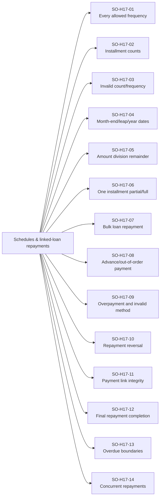

| Family | Scenario | Action path | Independent integrity witness | Registered tests |
| --- | --- | --- | --- | ---: |
| SO-H17-01 | Every allowed frequency | Weekly / biweekly / monthly schedule | Persisted expected due-date sequence | 3 |
| SO-H17-02 | Installment counts | Every supported integer count; 1 and UI 120 boundary | Exact row count; no duplicate installment numbers | 360 |
| SO-H17-03 | Invalid count/frequency | 0/negative/fractional/out-of-range/daily/unknown | Deployed validation verified; no false daily support | 1 |
| SO-H17-04 | Month-end/leap/year dates | 31st / leap day / year crossing | Correct calendar clipping and chronological dates | 9 |
| SO-H17-05 | Amount division remainder | Nondivisible principal → schedule | Last-installment remainder; exact sum | 4 |
| SO-H17-06 | One installment partial/full | Target installment → post payment | Balance/status/transaction link updated | 1 |
| SO-H17-07 | Bulk loan repayment | Payment spans several installments | Correct allocation and order/loan balance | 1 |
| SO-H17-08 | Advance/out-of-order payment | Later target before earlier due item | Actual allocation contract respected | 1 |
| SO-H17-09 | Overpayment and invalid method | Too much / nonsettlement method → RPC | No invalid receipt | 1 |
| SO-H17-10 | Repayment reversal | Original payment → full permitted reversal | Original account/method + separate counter-entry | 1 |
| SO-H17-11 | Payment link integrity | Each repayment row and reversal row | payment_transaction_id/reversal_transaction_id exact | 1 |
| SO-H17-12 | Final repayment completion | Last amount → zero loan balance | Correct loan/order paid status and next due | 1 |
| SO-H17-13 | Overdue boundaries | Before/on/after due date partitions | Expected persisted/projected overdue state | 3 |
| SO-H17-14 | Concurrent repayments | Two sessions settle final remainder | No double collection or negative balance | 1 |

## 18 · Cancellation & financial unwinding

Hosted action surface: cancel_order_with_financing or standard reversal + cancel write sequence.

Database graph: order · loan graph · payments/reversals · reservations · account movements.

Cross checks: draft/pending × standard/loan/installments × payments × accounts × commission state.

```mermaid
flowchart LR
    D18["Cancellation &amp; financial unwinding"]
    SO_H18_01["SO-H18-01<br/>Unpaid draft cancellation"]
    D18 --> SO_H18_01
    SO_H18_02["SO-H18-02<br/>Paid draft cancellation"]
    D18 --> SO_H18_02
    SO_H18_03["SO-H18-03<br/>Paid pending cancellation"]
    D18 --> SO_H18_03
    SO_H18_04["SO-H18-04<br/>Financed draft cancellation"]
    D18 --> SO_H18_04
    SO_H18_05["SO-H18-05<br/>Active simple loan cancellation"]
    D18 --> SO_H18_05
    SO_H18_06["SO-H18-06<br/>Installment financing cancellation"]
    D18 --> SO_H18_06
    SO_H18_07["SO-H18-07<br/>Several receipts and reversals"]
    D18 --> SO_H18_07
    SO_H18_08["SO-H18-08<br/>Voided or malformed linked money"]
    D18 --> SO_H18_08
    SO_H18_09["SO-H18-09<br/>Duplicate/missing/mismatched loan"]
    D18 --> SO_H18_09
    SO_H18_10["SO-H18-10<br/>Repeated cancel"]
    D18 --> SO_H18_10
    SO_H18_11["SO-H18-11<br/>Cancel vs complete race"]
    D18 --> SO_H18_11
    SO_H18_12["SO-H18-12<br/>Cancel vs loan payment race"]
    D18 --> SO_H18_12
    SO_H18_13["SO-H18-13<br/>Direct status cancellation bypass"]
    D18 --> SO_H18_13
    SO_H18_14["SO-H18-14<br/>Completed cancellation probe"]
    D18 --> SO_H18_14
    SO_H18_15["SO-H18-15<br/>Cancel → archive → unarchive"]
    D18 --> SO_H18_15
```

| Family | Scenario | Action path | Independent integrity witness | Registered tests |
| --- | --- | --- | --- | ---: |
| SO-H18-01 | Unpaid draft cancellation | Draft → cancelled | No money or stock movement | 1 |
| SO-H18-02 | Paid draft cancellation | Reverse receipts → cancel | Exact remaining money reversed | 1 |
| SO-H18-03 | Paid pending cancellation | Pending → cancel | Reservation released; no fulfillment deduction | 1 |
| SO-H18-04 | Financed draft cancellation | No activated loan → cancel RPC | No invented loan; planned money cleared correctly | 1 |
| SO-H18-05 | Active simple loan cancellation | Pending loan + repayments → cancel | Linked loan retired/cancelled; repayment history retained | 1 |
| SO-H18-06 | Installment financing cancellation | Schedule + down payment → cancel | Schedule retired; payments exactly reversed | 1 |
| SO-H18-07 | Several receipts and reversals | Partial prior reversal → cancel | Only unreversed portions counter-posted | 1 |
| SO-H18-08 | Voided or malformed linked money | Missing payment/void mismatch → cancel | Atomic failure; no incomplete unwinding | 1 |
| SO-H18-09 | Duplicate/missing/mismatched loan | Broken financial graph → cancel | Explicit validation failure with unchanged graph | 1 |
| SO-H18-10 | Repeated cancel | Cancelled order → same RPC again | Idempotent supported response; no new reversals | 1 |
| SO-H18-11 | Cancel vs complete race | Two authenticated sessions | Either cancelled with stock intact or completed with one deduction | 1 |
| SO-H18-12 | Cancel vs loan payment race | Repayment concurrent with cancellation | No active residual loan payment after cancellation | 1 |
| SO-H18-13 | Direct status cancellation bypass | Financed order status-only write | Atomic cancellation guard enforced | 1 |
| SO-H18-14 | Completed cancellation probe | Completed/full-returned → cancel | No invalid lifecycle unwind | 1 |
| SO-H18-15 | Cancel → archive → unarchive | Terminal order archive round-trip | Financial and inventory history unchanged | 1 |

## 19 · Standard returns & exact refunds

Hosted action surface: Production restore/refund/return header/item/order-summary Supabase write chain.

Database graph: order_returns · order_return_items · stock/movements · linked payment reversals.

Cross checks: all item subsets × paid/free quantities × methods × accounts × batches × return history.

```mermaid
flowchart LR
    D19["Standard returns &amp; exact refunds"]
    SO_H19_01["SO-H19-01<br/>One item partial return"]
    D19 --> SO_H19_01
    SO_H19_02["SO-H19-02<br/>One item full return"]
    D19 --> SO_H19_02
    SO_H19_03["SO-H19-03<br/>Whole order return"]
    D19 --> SO_H19_03
    SO_H19_04["SO-H19-04<br/>Several partial returns → full"]
    D19 --> SO_H19_04
    SO_H19_05["SO-H19-05<br/>Bonus-only return"]
    D19 --> SO_H19_05
    SO_H19_06["SO-H19-06<br/>Paid + bonus return"]
    D19 --> SO_H19_06
    SO_H19_07["SO-H19-07<br/>UoM return snapshots"]
    D19 --> SO_H19_07
    SO_H19_08["SO-H19-08<br/>Batch and regular restoration"]
    D19 --> SO_H19_08
    SO_H19_09["SO-H19-09<br/>Refund spans several receipts"]
    D19 --> SO_H19_09
    SO_H19_10["SO-H19-10<br/>Not enough posted payments"]
    D19 --> SO_H19_10
    SO_H19_11["SO-H19-11<br/>Already fully returned"]
    D19 --> SO_H19_11
    SO_H19_12["SO-H19-12<br/>Empty/duplicate/unknown return lines"]
    D19 --> SO_H19_12
    SO_H19_13["SO-H19-13<br/>Quantity boundary/over-return"]
    D19 --> SO_H19_13
    SO_H19_14["SO-H19-14<br/>Reason/role/own-only permission"]
    D19 --> SO_H19_14
    SO_H19_15["SO-H19-15<br/>Discount/tax/adjustment allocation"]
    D19 --> SO_H19_15
    SO_H19_16["SO-H19-16<br/>Locked and archived state"]
    D19 --> SO_H19_16
    SO_H19_17["SO-H19-17<br/>Return concurrency and interruption"]
    D19 --> SO_H19_17
```

| Family | Scenario | Action path | Independent integrity witness | Registered tests |
| --- | --- | --- | --- | ---: |
| SO-H19-01 | One item partial return | Completed → return paid portion | Stock, refund and remaining obligation exact | 1 |
| SO-H19-02 | One item full return | Return full remaining selected line | Line marked by authoritative return rows | 1 |
| SO-H19-03 | Whole order return | All remaining lines → one posted return | Full flag; completed lifecycle retained | 1 |
| SO-H19-04 | Several partial returns → full | Every line subset and action permutation | Cumulative refund equals original paid basis | 1 |
| SO-H19-05 | Bonus-only return | Return free quantity only | Stock restored; zero refund transaction | 1 |
| SO-H19-06 | Paid + bonus return | Both quantities in same request | Separate canonical parts; money only on paid value | 1 |
| SO-H19-07 | UoM return snapshots | Current unit renamed/changed → return saved line | Saved factor and stable identifiers used | 1 |
| SO-H19-08 | Batch and regular restoration | Partial batch-allocated sale → return | Correct original storage/batch restoration | 1 |
| SO-H19-09 | Refund spans several receipts | Latest remaining receipts cover return | Each counter-entry reverses exact portion | 1 |
| SO-H19-10 | Not enough posted payments | Return exceeds recorded net receipts | No phantom refund; interruption integrity checked | 1 |
| SO-H19-11 | Already fully returned | Another return attempt | No over-return or additional refund | 1 |
| SO-H19-12 | Empty/duplicate/unknown return lines | Malformed return request | No ambiguous header/items or stock effect | 1 |
| SO-H19-13 | Quantity boundary/over-return | Remaining ± quantity precision step | No excess paid or free return | 1 |
| SO-H19-14 | Reason/role/own-only permission | Blank reason / denied actor / own-other order | Server authorization and required reason tested | 1 |
| SO-H19-15 | Discount/tax/adjustment allocation | Fractional discounted order → partial/full return | Cumulative monetary rounding and final remainder | 1 |
| SO-H19-16 | Locked and archived state | Return probes in each state | Action-specific contract; full snapshot validation | 1 |
| SO-H19-17 | Return concurrency and interruption | Two same-line returns / pause after each write | No double refund; every durable prefix and recovery verified | 1 |

## 20 · Financed returns & debt reduction

Hosted action surface: Production return chain + linked loan/payment/schedule mutations.

Database graph: return graph · loans/installments/payments · transaction reversals · order totals.

Cross checks: loan/installments × unpaid/partial/full paid × refund vs debt boundary × return quantity.

```mermaid
flowchart LR
    D20["Financed returns &amp; debt reduction"]
    SO_H20_01["SO-H20-01<br/>Return smaller than outstanding debt"]
    D20 --> SO_H20_01
    SO_H20_02["SO-H20-02<br/>Return equals outstanding debt"]
    D20 --> SO_H20_02
    SO_H20_03["SO-H20-03<br/>Return exceeds outstanding debt"]
    D20 --> SO_H20_03
    SO_H20_04["SO-H20-04<br/>Fully paid financed order return"]
    D20 --> SO_H20_04
    SO_H20_05["SO-H20-05<br/>Partial then full financed return"]
    D20 --> SO_H20_05
    SO_H20_06["SO-H20-06<br/>Full simple-loan return"]
    D20 --> SO_H20_06
    SO_H20_07["SO-H20-07<br/>Full installment return"]
    D20 --> SO_H20_07
    SO_H20_08["SO-H20-08<br/>Initial repayment representation"]
    D20 --> SO_H20_08
    SO_H20_09["SO-H20-09<br/>Refund spans multiple loan receipts"]
    D20 --> SO_H20_09
    SO_H20_10["SO-H20-10<br/>Partial loan-payment refund"]
    D20 --> SO_H20_10
    SO_H20_11["SO-H20-11<br/>Refund schedule redistribution"]
    D20 --> SO_H20_11
    SO_H20_12["SO-H20-12<br/>Missing v1 repayment transaction"]
    D20 --> SO_H20_12
    SO_H20_13["SO-H20-13<br/>Legacy unmapped financing receipts"]
    D20 --> SO_H20_13
    SO_H20_14["SO-H20-14<br/>Bonus/UoM financed return"]
    D20 --> SO_H20_14
    SO_H20_15["SO-H20-15<br/>Return vs repayment race"]
    D20 --> SO_H20_15
    SO_H20_16["SO-H20-16<br/>Financed return interruption"]
    D20 --> SO_H20_16
```

| Family | Scenario | Action path | Independent integrity witness | Registered tests |
| --- | --- | --- | --- | ---: |
| SO-H20-01 | Return smaller than outstanding debt | Return value < loan balance | Debt reduced; no cash refunded | 1 |
| SO-H20-02 | Return equals outstanding debt | Return value = loan balance | Balance zero; exact remaining finance state | 1 |
| SO-H20-03 | Return exceeds outstanding debt | Return value > balance | Debt reduction + exact excess repayment refund | 1 |
| SO-H20-04 | Fully paid financed order return | Loan settled → partial return | Linked repayment counter-entries and new totals | 1 |
| SO-H20-05 | Partial then full financed return | All ordered subsets → final return | Complete debt/refund reconciliation | 1 |
| SO-H20-06 | Full simple-loan return | Original principal retained → loan cancelled | Zero remaining balance; separate money history | 1 |
| SO-H20-07 | Full installment return | Return all → schedule cancellation | Installments cancelled; no active debt | 1 |
| SO-H20-08 | Initial repayment representation | Simple-loan initial repayment vs installment down payment | Initial payment counted once | 1 |
| SO-H20-09 | Refund spans multiple loan receipts | Newest repayment portions → reversals | Exact remaining original amounts and links | 1 |
| SO-H20-10 | Partial loan-payment refund | Only portion consumed by return | Persisted loan-payment integrity and immutable original transaction | 1 |
| SO-H20-11 | Refund schedule redistribution | Return reduces remaining loan | Reallocated installments sum to remaining balance | 1 |
| SO-H20-12 | Missing v1 repayment transaction | Loan payment without linked source → return | No hidden fallback for invalid v1 history | 1 |
| SO-H20-13 | Legacy unmapped financing receipts | Legacy fixture → supported fallback path | Explicit outgoing refund and audit provenance | 1 |
| SO-H20-14 | Bonus/UoM financed return | Paid/free converted quantities | No free-bonus debt or money refund | 1 |
| SO-H20-15 | Return vs repayment race | Same loan two sessions | Consistent final loan, order and reversal graph | 1 |
| SO-H20-16 | Financed return interruption | Pause stock/payment/schedule/header boundaries | Recorded prefix; successful resume or preserved failure | 1 |

## 21 · Post-return corrections

Hosted action surface: Admin post-return adjustment order JSONB update + reconciliation.

Database graph: sales_orders adjustments · immutable order_returns/items · payments · commission entries.

Cross checks: partial/full return × addition/deduction × currencies × actor × lock/archive.

```mermaid
flowchart LR
    D21["Post-return corrections"]
    SO_H21_01["SO-H21-01<br/>Addition after partial return"]
    D21 --> SO_H21_01
    SO_H21_02["SO-H21-02<br/>Deduction after partial return"]
    D21 --> SO_H21_02
    SO_H21_03["SO-H21-03<br/>Correction after full return"]
    D21 --> SO_H21_03
    SO_H21_04["SO-H21-04<br/>Every correction currency pair"]
    D21 --> SO_H21_04
    SO_H21_05["SO-H21-05<br/>Several linked corrections"]
    D21 --> SO_H21_05
    SO_H21_06["SO-H21-06<br/>Staff/viewer correction attempt"]
    D21 --> SO_H21_06
    SO_H21_07["SO-H21-07<br/>Wrong/deleted/unposted return"]
    D21 --> SO_H21_07
    SO_H21_08["SO-H21-08<br/>No completed posted return"]
    D21 --> SO_H21_08
    SO_H21_09["SO-H21-09<br/>Locked/archived correction"]
    D21 --> SO_H21_09
    SO_H21_10["SO-H21-10<br/>Blank/zero/negative malformed correction"]
    D21 --> SO_H21_10
    SO_H21_11["SO-H21-11<br/>Immutable original return/payment"]
    D21 --> SO_H21_11
    SO_H21_12["SO-H21-12<br/>Commission reconciliation after correction"]
    D21 --> SO_H21_12
```

| Family | Scenario | Action path | Independent integrity witness | Registered tests |
| --- | --- | --- | --- | ---: |
| SO-H21-01 | Addition after partial return | Posted partial return → addition | New correction references exact return | 1 |
| SO-H21-02 | Deduction after partial return | Posted partial return → deduction | Correct document net amount | 1 |
| SO-H21-03 | Correction after full return | Full return → permitted correction | Historical full-return records retained | 1 |
| SO-H21-04 | Every correction currency pair | Original/order currencies → snapshot conversion | Historical rate basis and converted amount | 32 |
| SO-H21-05 | Several linked corrections | Multiple returns + several corrections | Each returnId valid; exact net document projection | 1 |
| SO-H21-06 | Staff/viewer correction attempt | Unauthorized role → update probe | No admin-only correction bypass | 1 |
| SO-H21-07 | Wrong/deleted/unposted return | Foreign/invalid return reference | No orphan correction | 1 |
| SO-H21-08 | No completed posted return | Draft/pending/unreturned → correction | Invalid correction denied | 1 |
| SO-H21-09 | Locked/archived correction | Forbidden state → write probe | No forbidden financial projection | 1 |
| SO-H21-10 | Blank/zero/negative malformed correction | Invalid adjustment payload | No invalid JSONB adjustment | 1 |
| SO-H21-11 | Immutable original return/payment | Correction → graph comparison | Original rows and reversal amounts unchanged | 1 |
| SO-H21-12 | Commission reconciliation after correction | Correction → reconcile repeated | Documented commission basis; no duplicate earned entry | 1 |

## 22 · Commission sources, plans & snapshots

Hosted action surface: Assignment/product rule writes → reconcile_sales_agent_commission.

Database graph: crm assignments/plans/memberships/product rules + earned/reversal entry tables.

Cross checks: none/manual/plan/product/combined × beneficiary count × payable/tracked × rule dates.

```mermaid
flowchart LR
    D22["Commission sources, plans &amp; snapshots"]
    SO_H22_01["SO-H22-01<br/>No commission attribution"]
    D22 --> SO_H22_01
    SO_H22_02["SO-H22-02<br/>Percentage plan"]
    D22 --> SO_H22_02
    SO_H22_03["SO-H22-03<br/>Fixed plan including zero"]
    D22 --> SO_H22_03
    SO_H22_04["SO-H22-04<br/>Custom levels and tier sheets"]
    D22 --> SO_H22_04
    SO_H22_05["SO-H22-05<br/>Manual fixed/percentage terms"]
    D22 --> SO_H22_05
    SO_H22_06["SO-H22-06<br/>Fixed-plan override"]
    D22 --> SO_H22_06
    SO_H22_07["SO-H22-07<br/>Several distinct beneficiaries"]
    D22 --> SO_H22_07
    SO_H22_08["SO-H22-08<br/>Product-rule commission"]
    D22 --> SO_H22_08
    SO_H22_09["SO-H22-09<br/>Creator-linked product agent"]
    D22 --> SO_H22_09
    SO_H22_10["SO-H22-10<br/>Sales-account beneficiary"]
    D22 --> SO_H22_10
    SO_H22_11["SO-H22-11<br/>Combined manual and product sources"]
    D22 --> SO_H22_11
    SO_H22_12["SO-H22-12<br/>Plan/rule dates and revisions"]
    D22 --> SO_H22_12
    SO_H22_13["SO-H22-13<br/>Excluded products/categories"]
    D22 --> SO_H22_13
    SO_H22_14["SO-H22-14<br/>Mode change after order save"]
    D22 --> SO_H22_14
    SO_H22_15["SO-H22-15<br/>Hidden legacy assignment controls"]
    D22 --> SO_H22_15
```

| Family | Scenario | Action path | Independent integrity witness | Registered tests |
| --- | --- | --- | --- | ---: |
| SO-H22-01 | No commission attribution | No enabled source → order complete | No commission lane or earned money invented | 1 |
| SO-H22-02 | Percentage plan | Eligible plan rate → complete | Correct sale/eligible basis and amount | 1 |
| SO-H22-03 | Fixed plan including zero | Fixed amount 0/positive → complete | Valid zero fixed plan; no unintended payout | 3 |
| SO-H22-04 | Custom levels and tier sheets | Each configured level/tier boundary | Correct effective tier and plan revision | 1 |
| SO-H22-05 | Manual fixed/percentage terms | Supported manual assignment APIs → reconcile | Entered amount/currency and rate snapshots | 2 |
| SO-H22-06 | Fixed-plan override | Same currency fixed amount override | Allowed fixed override; wrong type/currency denied | 1 |
| SO-H22-07 | Several distinct beneficiaries | All assignment combinations → complete | Separate per-agent basis; no duplicate agent | 1 |
| SO-H22-08 | Product-rule commission | Fixed/percent rule × paid/free unit quantities | Correct eligible lines and attribution | 1 |
| SO-H22-09 | Creator-linked product agent | Linked staff creator → order complete | Creator-product beneficiary retained | 1 |
| SO-H22-10 | Sales-account beneficiary | Enabled sales account → automatic assignment | Financial counterparty and beneficiary consistent | 1 |
| SO-H22-11 | Combined manual and product sources | Same/different agents → reconcile | No duplicate source earning | 1 |
| SO-H22-12 | Plan/rule dates and revisions | Before/on/after effective boundaries | Creation-time eligibility and historical snapshot | 1 |
| SO-H22-13 | Excluded products/categories | Mixed eligibility order → complete | Only eligible basis earns commission | 1 |
| SO-H22-14 | Mode change after order save | Payable/tracked setting changes → reconcile | Captured order lane remains historical | 1 |
| SO-H22-15 | Hidden legacy assignment controls | Stored manual API fixtures → contract tests | API coverage flagged separately from visible UI choices | 1 |

## 23 · Commission payout, tracking & recovery

Hosted action surface: reconcile_sales_agent_commission · record_sales_agent_commission_payout/recovery.

Database graph: earned/approved/payout/reversal/recovery entries · payments · accounts · partner ledger sources.

Cross checks: payable/tracked × unpaid/paid order × payout timing × account × return class.

```mermaid
flowchart LR
    D23["Commission payout, tracking &amp; recovery"]
    SO_H23_01["SO-H23-01<br/>Payable earning lifecycle"]
    D23 --> SO_H23_01
    SO_H23_02["SO-H23-02<br/>Tracked earning lifecycle"]
    D23 --> SO_H23_02
    SO_H23_03["SO-H23-03<br/>Tracked payout/approval probe"]
    D23 --> SO_H23_03
    SO_H23_04["SO-H23-04<br/>Manual payout on save"]
    D23 --> SO_H23_04
    SO_H23_05["SO-H23-05<br/>Automatic settlement"]
    D23 --> SO_H23_05
    SO_H23_06["SO-H23-06<br/>Partial/full commission payout"]
    D23 --> SO_H23_06
    SO_H23_07["SO-H23-07<br/>Wrong assignment/order/agent"]
    D23 --> SO_H23_07
    SO_H23_08["SO-H23-08<br/>Commission return before payout"]
    D23 --> SO_H23_08
    SO_H23_09["SO-H23-09<br/>Commission return after payout"]
    D23 --> SO_H23_09
    SO_H23_10["SO-H23-10<br/>Partial/full recovery collection"]
    D23 --> SO_H23_10
    SO_H23_11["SO-H23-11<br/>Insufficient funds or access"]
    D23 --> SO_H23_11
    SO_H23_12["SO-H23-12<br/>Reconciliation replay"]
    D23 --> SO_H23_12
    SO_H23_13["SO-H23-13<br/>Concurrent payout/recovery"]
    D23 --> SO_H23_13
    SO_H23_14["SO-H23-14<br/>Settlement response loss"]
    D23 --> SO_H23_14
```

| Family | Scenario | Action path | Independent integrity witness | Registered tests |
| --- | --- | --- | --- | ---: |
| SO-H23-01 | Payable earning lifecycle | Complete → approval where required → payout | Correct outstanding beneficiary balance | 1 |
| SO-H23-02 | Tracked earning lifecycle | Complete in tracked mode | Tracked tables; no payable obligation | 1 |
| SO-H23-03 | Tracked payout/approval probe | Attempt payout or payable approval | No real commission payment | 1 |
| SO-H23-04 | Manual payout on save | Saved due commission → each beneficiary settled | Order-linked outgoing payment and account movement | 1 |
| SO-H23-05 | Automatic settlement | Configured automatic mode + collected order | Correct amount and source account policy | 1 |
| SO-H23-06 | Partial/full commission payout | Every standard method × amount boundary | Payout never exceeds outstanding entitlement | 1 |
| SO-H23-07 | Wrong assignment/order/agent | Tampered payout references | No unrelated commission settlement | 1 |
| SO-H23-08 | Commission return before payout | Partial/full return → reconcile | Earned reversal adjusts payable balance | 1 |
| SO-H23-09 | Commission return after payout | Previously paid → return | Recoverable amount and recovery obligation exact | 1 |
| SO-H23-10 | Partial/full recovery collection | Recovery due → incoming collection | Correct beneficiary recovery counter-effects | 1 |
| SO-H23-11 | Insufficient funds or access | Outgoing payout denied by account | No detached payout or money transaction | 1 |
| SO-H23-12 | Reconciliation replay | Repeat completion/return reconciliation | Stable natural keys; no duplicate entries | 1 |
| SO-H23-13 | Concurrent payout/recovery | Two sessions same remaining entitlement | No oversettlement | 1 |
| SO-H23-14 | Settlement response loss | Commit → lose response → retry | Exactly one business settlement or explicit unresolved defect | 1 |

## 24 · Marketplace state and delivery integration

Hosted action surface: transition_marketplace_order · edit_marketplace_order_items · applicable order-placement Edge Function.

Database graph: marketplace_orders · crm order/customer/partner · stock/transactions · delivery attribution.

Cross checks: marketplace state × allowed next action × item edits × counterparty × price book × money state.

```mermaid
flowchart LR
    D24["Marketplace state and delivery integration"]
    SO_H24_01["SO-H24-01<br/>Every adjacent forward transition"]
    D24 --> SO_H24_01
    SO_H24_02["SO-H24-02<br/>Advance to later target"]
    D24 --> SO_H24_02
    SO_H24_03["SO-H24-03<br/>Backward/skip/unknown direct transition"]
    D24 --> SO_H24_03
    SO_H24_04["SO-H24-04<br/>Every permitted cancellation stage"]
    D24 --> SO_H24_04
    SO_H24_05["SO-H24-05<br/>Shipped/delivered cancellation probe"]
    D24 --> SO_H24_05
    SO_H24_06["SO-H24-06<br/>Permitted item edits"]
    D24 --> SO_H24_06
    SO_H24_07["SO-H24-07<br/>Item edit failure cases"]
    D24 --> SO_H24_07
    SO_H24_08["SO-H24-08<br/>Delivery creates CRM sale order"]
    D24 --> SO_H24_08
    SO_H24_09["SO-H24-09<br/>Repeated/concurrent delivery"]
    D24 --> SO_H24_09
    SO_H24_10["SO-H24-10<br/>Marketplace price-book source"]
    D24 --> SO_H24_10
    SO_H24_11["SO-H24-11<br/>Unpaid e-commerce return"]
    D24 --> SO_H24_11
    SO_H24_12["SO-H24-12<br/>Paid/partial e-commerce state"]
    D24 --> SO_H24_12
    SO_H24_13["SO-H24-13<br/>Delivery agent commission"]
    D24 --> SO_H24_13
    SO_H24_14["SO-H24-14<br/>Placement request contracts"]
    D24 --> SO_H24_14
    SO_H24_15["SO-H24-15<br/>Warning and partial advancement"]
    D24 --> SO_H24_15
```

| Family | Scenario | Action path | Independent integrity witness | Registered tests |
| --- | --- | --- | --- | ---: |
| SO-H24-01 | Every adjacent forward transition | Pending→confirmed→processing→shipped→delivered | Correct persisted state after every RPC | 1 |
| SO-H24-02 | Advance to later target | Every later target from every active state | Intermediate transitions verified individually | 1 |
| SO-H24-03 | Backward/skip/unknown direct transition | Invalid status request → RPC | No illegal server transition | 1 |
| SO-H24-04 | Every permitted cancellation stage | Pending/confirmed/processing → cancel | Reason and linked effects consistent | 1 |
| SO-H24-05 | Shipped/delivered cancellation probe | Finalized or shipped state → cancel | Terminal transition policy enforced | 1 |
| SO-H24-06 | Permitted item edits | Add/remove/change quantity before permitted cutoff | Valid server price snapshots and totals | 1 |
| SO-H24-07 | Item edit failure cases | Stale/deleted/foreign products and invalid quantities | No partial marketplace or CRM update | 1 |
| SO-H24-08 | Delivery creates CRM sale order | Delivered → independent CRM graph read | One linked completed order and counterparty | 1 |
| SO-H24-09 | Repeated/concurrent delivery | Same order delivered twice | One CRM order and one stock effect | 1 |
| SO-H24-10 | Marketplace price-book source | Storefront pricing → delivered CRM order | Consistent provenance and currency | 1 |
| SO-H24-11 | Unpaid e-commerce return | Completed unpaid marketplace order → return | Receivable reduced; no cash reversal | 1 |
| SO-H24-12 | Paid/partial e-commerce state | Collection → return | Money policy verified; no double refund | 1 |
| SO-H24-13 | Delivery agent commission | Delivery attribution → complete/return | Correct product recipient and earned/reversal history | 1 |
| SO-H24-14 | Placement request contracts | Each applicable hosted placement function → workflow | Verified request/row shape; external delivery excluded | 1 |
| SO-H24-15 | Warning and partial advancement | Failure at intermediate transition | Last committed state and actionable response retained | 1 |

## 25 · Locking, deletion, archive & terminal states

Hosted action surface: Order lock/save/delete requests + archive flag trigger.

Database graph: sales_orders · schedule/deletion flags · full related transaction graph.

Cross checks: every lifecycle × payment × return × approval × lock × archive × persona.

```mermaid
flowchart LR
    D25["Locking, deletion, archive &amp; terminal states"]
    SO_H25_01["SO-H25-01<br/>Fully paid lock"]
    D25 --> SO_H25_01
    SO_H25_02["SO-H25-02<br/>Unpaid lock attempt"]
    D25 --> SO_H25_02
    SO_H25_03["SO-H25-03<br/>Partial-paid lock discrepancy"]
    D25 --> SO_H25_03
    SO_H25_04["SO-H25-04<br/>Locked payment action matrix"]
    D25 --> SO_H25_04
    SO_H25_05["SO-H25-05<br/>Draft unpaid soft deletion"]
    D25 --> SO_H25_05
    SO_H25_06["SO-H25-06<br/>Posted-payment delete attempt"]
    D25 --> SO_H25_06
    SO_H25_07["SO-H25-07<br/>Active order delete attempt"]
    D25 --> SO_H25_07
    SO_H25_08["SO-H25-08<br/>Cancelled/legacy returned deletion"]
    D25 --> SO_H25_08
    SO_H25_09["SO-H25-09<br/>Archive cancelled order"]
    D25 --> SO_H25_09
    SO_H25_10["SO-H25-10<br/>Archive full-returned order"]
    D25 --> SO_H25_10
    SO_H25_11["SO-H25-11<br/>Archive active/partial-returned probe"]
    D25 --> SO_H25_11
    SO_H25_12["SO-H25-12<br/>Unarchive/rearchive loops"]
    D25 --> SO_H25_12
    SO_H25_13["SO-H25-13<br/>Archived financial action probes"]
    D25 --> SO_H25_13
    SO_H25_14["SO-H25-14<br/>Archive optimistic concurrency"]
    D25 --> SO_H25_14
    SO_H25_15["SO-H25-15<br/>Read/print-source after archive"]
    D25 --> SO_H25_15
```

| Family | Scenario | Action path | Independent integrity witness | Registered tests |
| --- | --- | --- | --- | ---: |
| SO-H25-01 | Fully paid lock | Paid permitted order → lock | Payment lock persisted | 1 |
| SO-H25-02 | Unpaid lock attempt | No posted money → lock | No invalid lock | 1 |
| SO-H25-03 | Partial-paid lock discrepancy | Partial order exposed lock action → helper/API | Expected contract reconciled; discrepancy retained | 1 |
| SO-H25-04 | Locked payment action matrix | Collect/unpay/reverse/installment/correction probes | Action-specific lock enforcement | 1 |
| SO-H25-05 | Draft unpaid soft deletion | Delete permissible draft | Soft delete; no orphan obligations | 1 |
| SO-H25-06 | Posted-payment delete attempt | Draft with net paid amount → delete | No loss of payment history | 1 |
| SO-H25-07 | Active order delete attempt | Pending/completed → delete | No removal of active transaction graph | 1 |
| SO-H25-08 | Cancelled/legacy returned deletion | Every supported terminal fixture → delete | Actual contract scoped; no assumed UI action | 1 |
| SO-H25-09 | Archive cancelled order | Cancelled → archive | Only archive flag changes | 1 |
| SO-H25-10 | Archive full-returned order | Completed + full return → archive | Completed lifecycle and entire graph preserved | 1 |
| SO-H25-11 | Archive active/partial-returned probe | Draft/pending/completed/partial → archive | Database rejects ineligible state | 1 |
| SO-H25-12 | Unarchive/rearchive loops | Terminal archive ↔ unarchive × loop boundaries | No number/version/money/stock drift beyond contract | 1 |
| SO-H25-13 | Archived financial action probes | Every mutation while archived | No forbidden terminal changes | 1 |
| SO-H25-14 | Archive optimistic concurrency | Stale expected flag / two sessions | Conflict or valid single flag change | 1 |
| SO-H25-15 | Read/print-source after archive | Archived order → hosted read | Record accessible under permission; financial history unchanged | 1 |

## 26 · Reads, projections & invoice metadata

Hosted action surface: Authenticated list/detail/partner RPCs + invoice metadata persistence.

Database graph: orders · partner/customer summary sources · invoices · invoice_versions · marketplace links.

Cross checks: every terminal state × visibility × query filters × currency × pagination × document origin.

```mermaid
flowchart LR
    D26["Reads, projections &amp; invoice metadata"]
    SO_H26_01["SO-H26-01<br/>Fresh order detail"]
    D26 --> SO_H26_01
    SO_H26_02["SO-H26-02<br/>Active/archived/deleted lists"]
    D26 --> SO_H26_02
    SO_H26_03["SO-H26-03<br/>Status/payment/return filters"]
    D26 --> SO_H26_03
    SO_H26_04["SO-H26-04<br/>Date/search/agent/customer filters"]
    D26 --> SO_H26_04
    SO_H26_05["SO-H26-05<br/>Pagination boundaries"]
    D26 --> SO_H26_05
    SO_H26_06["SO-H26-06<br/>Equal timestamps pagination"]
    D26 --> SO_H26_06
    SO_H26_07["SO-H26-07<br/>Partner receivable ledger"]
    D26 --> SO_H26_07
    SO_H26_08["SO-H26-08<br/>Financed partner ledger"]
    D26 --> SO_H26_08
    SO_H26_09["SO-H26-09<br/>Commission financial projection"]
    D26 --> SO_H26_09
    SO_H26_10["SO-H26-10<br/>Invoice snapshot metadata"]
    D26 --> SO_H26_10
    SO_H26_11["SO-H26-11<br/>Invoice version metadata"]
    D26 --> SO_H26_11
    SO_H26_12["SO-H26-12<br/>Hosted print-source integrity"]
    D26 --> SO_H26_12
    SO_H26_13["SO-H26-13<br/>Projection update failure"]
    D26 --> SO_H26_13
    SO_H26_14["SO-H26-14<br/>Realtime visibility/reconnect"]
    D26 --> SO_H26_14
    SO_H26_15["SO-H26-15<br/>Sales order integrity audit action"]
    D26 --> SO_H26_15
```

| Family | Scenario | Action path | Independent integrity witness | Registered tests |
| --- | --- | --- | --- | ---: |
| SO-H26-01 | Fresh order detail | New session → detail graph | No stale cached status or fields | 1 |
| SO-H26-02 | Active/archived/deleted lists | Every state through server queries | Correct filter inclusion and stable ordering | 1 |
| SO-H26-03 | Status/payment/return filters | All categorical filter combinations | Exact set of hosted matching records | 45 |
| SO-H26-04 | Date/search/agent/customer filters | Bounded dates and text/facet queries | No cross-workspace leakage or missed matches | 1 |
| SO-H26-05 | Pagination boundaries | Empty/one/page/page+1/>500/>1000 rows | No truncated or duplicated graph rows | 7 |
| SO-H26-06 | Equal timestamps pagination | Many rows at same timestamp | Deterministic secondary ordering | 1 |
| SO-H26-07 | Partner receivable ledger | Create/collect/reverse/return/cancel | Independent per-currency source ledger matches summaries | 1 |
| SO-H26-08 | Financed partner ledger | Order + loan + down/initial payment | No double-counted receivable or initial repayment | 1 |
| SO-H26-09 | Commission financial projection | Earn/pay/recover in both modes | Payable/tracked sources classified correctly | 1 |
| SO-H26-10 | Invoice snapshot metadata | Applicable save path → invoices read | Order/source/origin/creator/currency links exact | 1 |
| SO-H26-11 | Invoice version metadata | A4/receipt version contracts → read | Unique positive version; format/path/size/workspace valid | 1 |
| SO-H26-12 | Hosted print-source integrity | Reload returned/UoM/adjusted order fields | All required persisted document values; no PDF-layout assertion | 1 |
| SO-H26-13 | Projection update failure | Business commit succeeds; summary refresh fails | Authoritative graph preserved; convergence or reported failure | 1 |
| SO-H26-14 | Realtime visibility/reconnect | Hosted subscription + subsequent new read | Permitted committed state; no cross-tenant event leak | 1 |
| SO-H26-15 | Sales order integrity audit action | Authorized audit → hosted graph reads → findings | Read-only result categories; no cache mutation, repair or unrelated records | 1 |

## 27 · Remote contracts & direct bypass probes

Hosted action surface: Every hosted mutation endpoint, directly authenticated.

Database graph: Every exposed order-related table/RPC and all affected records.

Cross checks: endpoint × malformed field × persona × state × identifier linkage.

```mermaid
flowchart LR
    D27["Remote contracts &amp; direct bypass probes"]
    SO_H27_01["SO-H27-01<br/>Required IDs and argument names"]
    D27 --> SO_H27_01
    SO_H27_02["SO-H27-02<br/>Snake/camel/JSON shape contract"]
    D27 --> SO_H27_02
    SO_H27_03["SO-H27-03<br/>Numeric invalid representations"]
    D27 --> SO_H27_03
    SO_H27_04["SO-H27-04<br/>Unknown enums"]
    D27 --> SO_H27_04
    SO_H27_05["SO-H27-05<br/>Foreign key/workspace mismatch"]
    D27 --> SO_H27_05
    SO_H27_06["SO-H27-06<br/>Tampered computed fields"]
    D27 --> SO_H27_06
    SO_H27_07["SO-H27-07<br/>Unauthorized direct table write"]
    D27 --> SO_H27_07
    SO_H27_08["SO-H27-08<br/>Forged commission attribution"]
    D27 --> SO_H27_08
    SO_H27_09["SO-H27-09<br/>Return history rewrite/delete"]
    D27 --> SO_H27_09
    SO_H27_10["SO-H27-10<br/>Reversal link tampering"]
    D27 --> SO_H27_10
    SO_H27_11["SO-H27-11<br/>Unexpected result envelope"]
    D27 --> SO_H27_11
    SO_H27_12["SO-H27-12<br/>Zero affected rows under RLS"]
    D27 --> SO_H27_12
    SO_H27_13["SO-H27-13<br/>Migration/schema drift"]
    D27 --> SO_H27_13
    SO_H27_14["SO-H27-14<br/>User-friendly failure contract"]
    D27 --> SO_H27_14
```

| Family | Scenario | Action path | Independent integrity witness | Registered tests |
| --- | --- | --- | --- | ---: |
| SO-H27-01 | Required IDs and argument names | Missing/null/wrong UUID or RPC argument | Clear rejected contract; no writes | 1 |
| SO-H27-02 | Snake/camel/JSON shape contract | Actual production top-level and item payloads | Correct mapping without silently lost fields | 1 |
| SO-H27-03 | Numeric invalid representations | NaN/Infinity/text/negative/overflow/extra precision | Finite bounded values or explicit denial | 1 |
| SO-H27-04 | Unknown enums | Method/status/frequency/currency/source/return type | No unsupported semantic record | 1 |
| SO-H27-05 | Foreign key/workspace mismatch | Swap product/storage/partner/loan/account/return IDs | No cross-tenant graph edges | 1 |
| SO-H27-06 | Tampered computed fields | Totals/paid/balance/fulfilled/reserved quantities | Server-side invariant enforcement assessed | 1 |
| SO-H27-07 | Unauthorized direct table write | Skip RPC; change protected terminal fields | No atomic/permission guard bypass | 1 |
| SO-H27-08 | Forged commission attribution | Source/revision/agent/lane metadata tampering | No unauthorized earned/payable record | 1 |
| SO-H27-09 | Return history rewrite/delete | Modify posted return/item/payment history | Audit history restrictions verified | 1 |
| SO-H27-10 | Reversal link tampering | Wrong original/source/amount/currency/direction | No orphan or excessive counter-entry | 1 |
| SO-H27-11 | Unexpected result envelope | Conflict/error/no row/partial envelope | No success classification without persisted integrity | 1 |
| SO-H27-12 | Zero affected rows under RLS | Update invisible row → no error/no data | Mutation treated as denied; observer unchanged | 1 |
| SO-H27-13 | Migration/schema drift | Missing table/column/RPC/grant/constraint | Explicit environment blocked result | 1 |
| SO-H27-14 | User-friendly failure contract | Real failed request → production error mapping | Sanitized actionable result; database evidence retained | 1 |

## 28 · Concurrency, transport faults & recovery

Hosted action surface: Independent real Supabase sessions + controlled transport interruption.

Database graph: Entire before/after transaction graph + operation receipts and natural keys.

Cross checks: every mutating action × every request boundary × replay class × race pair.

```mermaid
flowchart LR
    D28["Concurrency, transport faults &amp; recovery"]
    SO_H28_01["SO-H28-01<br/>Same request simultaneous retry"]
    D28 --> SO_H28_01
    SO_H28_02["SO-H28-02<br/>Different request IDs same business target"]
    D28 --> SO_H28_02
    SO_H28_03["SO-H28-03<br/>Response lost after commit"]
    D28 --> SO_H28_03
    SO_H28_04["SO-H28-04<br/>Request interrupted before commit"]
    D28 --> SO_H28_04
    SO_H28_05["SO-H28-05<br/>Pause every multi-write boundary"]
    D28 --> SO_H28_05
    SO_H28_06["SO-H28-06<br/>Process/session restart"]
    D28 --> SO_H28_06
    SO_H28_07["SO-H28-07<br/>Completion vs completion"]
    D28 --> SO_H28_07
    SO_H28_08["SO-H28-08<br/>Completion vs cancellation"]
    D28 --> SO_H28_08
    SO_H28_09["SO-H28-09<br/>Return vs return"]
    D28 --> SO_H28_09
    SO_H28_10["SO-H28-10<br/>Return vs repayment/settlement"]
    D28 --> SO_H28_10
    SO_H28_11["SO-H28-11<br/>Cancellation vs repayment"]
    D28 --> SO_H28_11
    SO_H28_12["SO-H28-12<br/>Edit vs approval/reservation"]
    D28 --> SO_H28_12
    SO_H28_13["SO-H28-13<br/>Payout vs return/recovery"]
    D28 --> SO_H28_13
    SO_H28_14["SO-H28-14<br/>Archive vs money/return action"]
    D28 --> SO_H28_14
    SO_H28_15["SO-H28-15<br/>Two last-stock orders"]
    D28 --> SO_H28_15
    SO_H28_16["SO-H28-16<br/>Transient server/network failure"]
    D28 --> SO_H28_16
    SO_H28_17["SO-H28-17<br/>Operation payload collision"]
    D28 --> SO_H28_17
    SO_H28_18["SO-H28-18<br/>Long seeded model sequences"]
    D28 --> SO_H28_18
```

| Family | Scenario | Action path | Independent integrity witness | Registered tests |
| --- | --- | --- | --- | ---: |
| SO-H28-01 | Same request simultaneous retry | Two clients same order/operation/payment ID | Exactly one allowed business effect | 1 |
| SO-H28-02 | Different request IDs same business target | Two final collections/completions/returns | No duplicate effect through new identity | 1 |
| SO-H28-03 | Response lost after commit | Send → commit → drop response → reread/retry | Existing commit detected and reconciled | 1 |
| SO-H28-04 | Request interrupted before commit | Abort at known pre-commit boundary | No false success; real committed state determined | 1 |
| SO-H28-05 | Pause every multi-write boundary | Save/approve/return/cancel/settle chains | Each possible durable prefix captured | 26 |
| SO-H28-06 | Process/session restart | Interrupt → new authenticated process → resume | Recovery relies on hosted state | 1 |
| SO-H28-07 | Completion vs completion | Same/shared inventory → simultaneous complete | One fulfillment per order; no deficit | 1 |
| SO-H28-08 | Completion vs cancellation | Same financed order two actions | One valid terminal winner; no mixed graph | 1 |
| SO-H28-09 | Return vs return | Same remaining item quantity | No duplicate stock restoration or refund | 1 |
| SO-H28-10 | Return vs repayment/settlement | Same order/loan balance contested | Correct debt/refund/receipt net | 1 |
| SO-H28-11 | Cancellation vs repayment | Same linked loan contested | No active residual money or loan | 1 |
| SO-H28-12 | Edit vs approval/reservation | Same version, differing snapshots | Consistent approved/reserved snapshot | 1 |
| SO-H28-13 | Payout vs return/recovery | Same beneficiary financial balance | No overpaid/recovered entitlement | 1 |
| SO-H28-14 | Archive vs money/return action | Terminal flags contested | No prohibited archived mutation | 1 |
| SO-H28-15 | Two last-stock orders | Different order IDs shared stock/batches | No aggregate overselling | 1 |
| SO-H28-16 | Transient server/network failure | Real remote errors / transport fault → bounded retry | No duplicate effect; actionable exhausted failure | 1 |
| SO-H28-17 | Operation payload collision | ID reused with different payload hash | Explicit conflict, no mutation | 1 |
| SO-H28-18 | Long seeded model sequences | Valid/invalid action choices across abstract states | Invariant checked after every action; replayable seed | 1 |

## 29 · Historical records & integrity detection

Hosted action surface: Run-owned hosted legacy fixtures → lifecycle reads/probes + independent auditor.

Database graph: Historical orders/items/returns/payments/loans/commission metadata.

Cross checks: missing field classes × legacy finance representation × return/lock/archive state.

```mermaid
flowchart LR
    D29["Historical records &amp; integrity detection"]
    SO_H29_01["SO-H29-01<br/>Missing historical fulfilled quantity"]
    D29 --> SO_H29_01
    SO_H29_02["SO-H29-02<br/>Legacy base-unit snapshots"]
    D29 --> SO_H29_02
    SO_H29_03["SO-H29-03<br/>Legacy initial loan payment"]
    D29 --> SO_H29_03
    SO_H29_04["SO-H29-04<br/>Legacy full return loan state"]
    D29 --> SO_H29_04
    SO_H29_05["SO-H29-05<br/>Missing historical costs/rates"]
    D29 --> SO_H29_05
    SO_H29_06["SO-H29-06<br/>Duplicate/orphan payment link"]
    D29 --> SO_H29_06
    SO_H29_07["SO-H29-07<br/>Duplicate/orphan return line"]
    D29 --> SO_H29_07
    SO_H29_08["SO-H29-08<br/>Duplicate loan/commission natural key"]
    D29 --> SO_H29_08
    SO_H29_09["SO-H29-09<br/>Movement arithmetic mismatch"]
    D29 --> SO_H29_09
    SO_H29_10["SO-H29-10<br/>Account movement mismatch"]
    D29 --> SO_H29_10
    SO_H29_11["SO-H29-11<br/>Order totals drift"]
    D29 --> SO_H29_11
    SO_H29_12["SO-H29-12<br/>No repair during assertion"]
    D29 --> SO_H29_12
```

| Family | Scenario | Action path | Independent integrity witness | Registered tests |
| --- | --- | --- | --- | ---: |
| SO-H29-01 | Missing historical fulfilled quantity | Legacy completed lines → fresh read | Supported fallback; actual sale movement still verified | 1 |
| SO-H29-02 | Legacy base-unit snapshots | Missing selected/base identifiers → return | Correct compatibility or explicit unsupported branch | 1 |
| SO-H29-03 | Legacy initial loan payment | Order down payment vs repayment representation | One financial amount in loan/order/ledger | 1 |
| SO-H29-04 | Legacy full return loan state | Existing full-return fixture → audit | No surviving active debt or schedule | 1 |
| SO-H29-05 | Missing historical costs/rates | Incomplete immutable snapshots → auditor | Named warning/failure; no invented reconstruction | 1 |
| SO-H29-06 | Duplicate/orphan payment link | Fault fixture graph → independent audit | Exact primary keys and failing invariant | 1 |
| SO-H29-07 | Duplicate/orphan return line | Header/item/reference inconsistency | Correct relationship and cumulative-quantity failure | 1 |
| SO-H29-08 | Duplicate loan/commission natural key | Fault fixture or denied duplicate insertion | Integrity guard or auditor catches ambiguity | 1 |
| SO-H29-09 | Movement arithmetic mismatch | Previous/delta/new stock mismatch | Inventory history failure detected | 1 |
| SO-H29-10 | Account movement mismatch | Missing/orphan/wrong amount movement | Independent money delta failure | 1 |
| SO-H29-11 | Order totals drift | Corrupted summary vs legitimate source rows | Auditor catches summary mismatch | 1 |
| SO-H29-12 | No repair during assertion | Detected corruption → result/evidence | Failing graph retained; production bug not silently corrected | 1 |

## 30 · Runner isolation, evidence & final reconciliation

Hosted action surface: Hosted fixtures → manifest → action runner → independent graph audit.

Database graph: Run-owned fixture manifest and every touched hosted record.

Cross checks: domain selection × repeat seed × restart point × data mode × persona × outcome.

```mermaid
flowchart LR
    D30["Runner isolation, evidence &amp; final reconciliation"]
    SO_H30_01["SO-H30-01<br/>Independent hosted selections"]
    D30 --> SO_H30_01
    SO_H30_02["SO-H30-02<br/>Full exhaustive selection"]
    D30 --> SO_H30_02
    SO_H30_03["SO-H30-03<br/>Strict target identity"]
    D30 --> SO_H30_03
    SO_H30_04["SO-H30-04<br/>No hidden environment skip"]
    D30 --> SO_H30_04
    SO_H30_05["SO-H30-05<br/>Stable case identity and seed"]
    D30 --> SO_H30_05
    SO_H30_06["SO-H30-06<br/>Isolated parallel fixtures"]
    D30 --> SO_H30_06
    SO_H30_07["SO-H30-07<br/>Explicit race fixtures"]
    D30 --> SO_H30_07
    SO_H30_08["SO-H30-08<br/>Resume incomplete run"]
    D30 --> SO_H30_08
    SO_H30_09["SO-H30-09<br/>Read failures never pass"]
    D30 --> SO_H30_09
    SO_H30_10["SO-H30-10<br/>Per-step and terminal sweeps"]
    D30 --> SO_H30_10
    SO_H30_11["SO-H30-11<br/>Cleanup evidence and balance"]
    D30 --> SO_H30_11
    SO_H30_12["SO-H30-12<br/>Failure report preservation"]
    D30 --> SO_H30_12
```

| Family | Scenario | Action path | Independent integrity witness | Registered tests |
| --- | --- | --- | --- | ---: |
| SO-H30-01 | Independent hosted selections | Run each of 30 groups alone | Prerequisites and fixture graph explicit | 1 |
| SO-H30-02 | Full exhaustive selection | All choice tuples and state/action paths | Generated denominator and executed count exact | 1 |
| SO-H30-03 | Strict target identity | Wrong project/workspace/credentials/config | Run blocked before fixture writes | 1 |
| SO-H30-04 | No hidden environment skip | Missing feature/schema/persona observer | Blocked cell counted separately from passed coverage | 1 |
| SO-H30-05 | Stable case identity and seed | Same generated tuple → repeated run | Deterministic ID, expected graph and replay manifest | 1 |
| SO-H30-06 | Isolated parallel fixtures | Independent cases running together | No shared product/account contamination | 1 |
| SO-H30-07 | Explicit race fixtures | Concurrency cases share named resources | Attribution and initial baseline known | 1 |
| SO-H30-08 | Resume incomplete run | Manifest + hosted state → resumed execution | Already committed action not posted twice | 1 |
| SO-H30-09 | Read failures never pass | Denied/missing/timeout observer read | Verification failure or block, never empty-data success | 1 |
| SO-H30-10 | Per-step and terminal sweeps | After each action + end of run | No orphan money/stock/loan/return/commission record | 1 |
| SO-H30-11 | Cleanup evidence and balance | Retire owned fixtures via supported actions | No unrelated record changed; immutable history retained | 1 |
| SO-H30-12 | Failure report preservation | Mismatch → retain fixture IDs and graph diff | Reproducible product defect; assertions remain strict | 1 |
